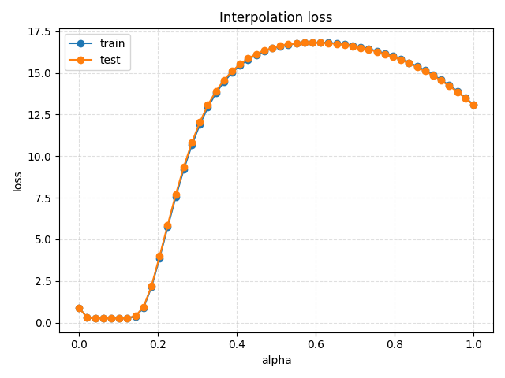
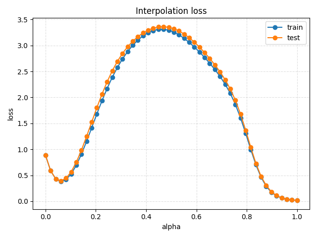
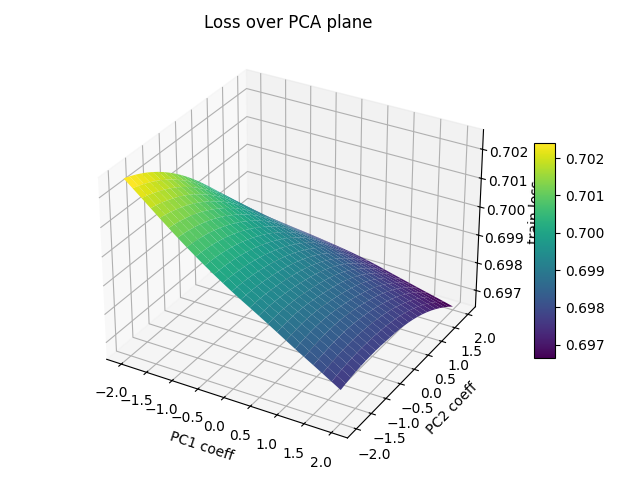
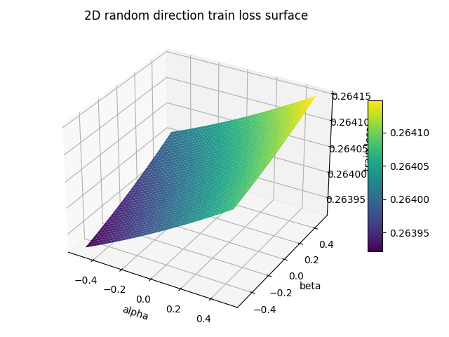
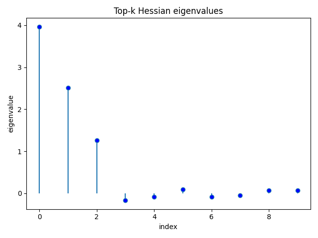
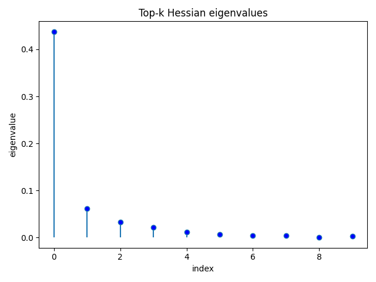
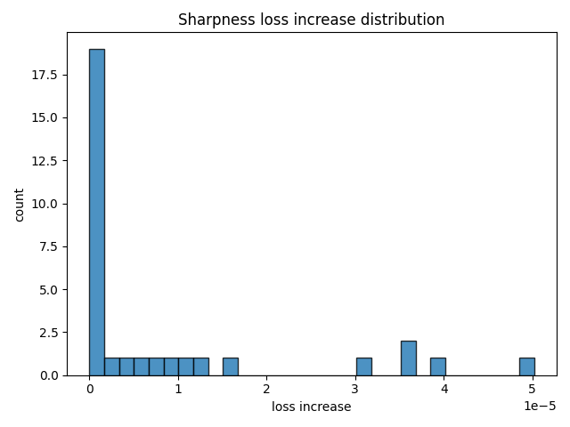
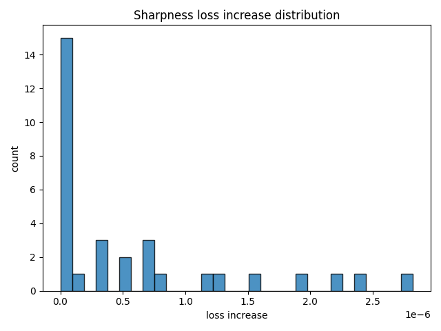
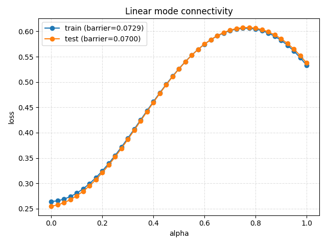
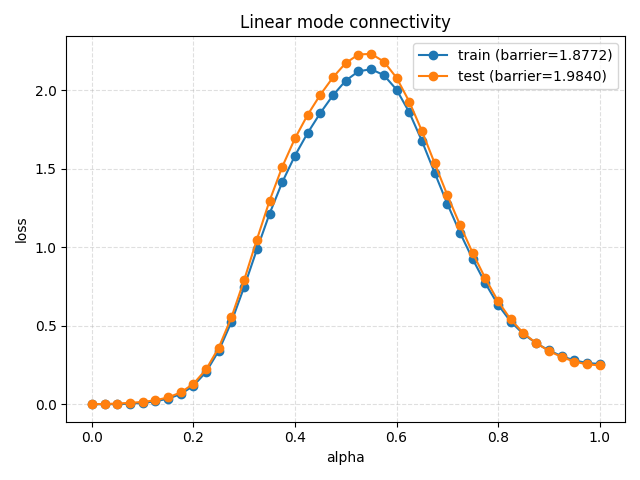

# Loss Landscape Geometry of MLPs on Synthetic Datasets

## 1. Overview

This project builds a complete, reproducible pipeline to study how the **loss landscape geometry** of multilayer perceptrons (MLPs) relates to **optimization dynamics**, **generalization**, and **design choices** (depth, width, activation, optimizer).  
We train a matrix of MLPs on synthetic classification tasks, probe the surrounding loss landscape using several complementary methods, and summarize both performance and geometry in figures and reports.

Concretely, the pipeline:
- trains MLPs of varying depth/width, activations (ReLU, Tanh, GELU), and optimizers (SGD, Adam) on 2D synthetic datasets (here: moons);
- saves checkpoints and metrics for each configuration and seed;
- probes the loss landscape around trained solutions using interpolation, random directional slices, Hessian spectrum estimation, sharpness metrics, PCA-based projections, and mode connectivity analysis;
- generates figures under `reports/figures/` and Markdown summaries under `reports/`.

This report is intended as a **single final submission** document. The main body provides a narrative overview and key findings; full detailed tables are collected in **Appendix A–F** for reference.

---

## 2. Experimental Setup

### 2.1 Datasets

All experiments summarized here are run on the **two-moons** synthetic dataset:
- 2D inputs with two interleaving half-moon clusters.
- Train/test splits with normalization based on the training statistics.
- A small amount of Gaussian noise added to inputs, as configured in `DatasetConfig`.

The code also supports concentric circles, Gaussian mixtures (2–4 clusters), and XOR-like datasets via `project/data/datasets.py`. The same pipeline can be applied to these by enabling `--include-circles` / `--include-xor` when running the training sweep.

### 2.2 Model Architectures

All models are fully-connected MLP classifiers implemented in `project/models/mlp.py`:
- variable depth and width with a shared hidden size per model,
- activations: **ReLU**, **Tanh**, or **GELU**,
- He (Kaiming) initialization for ReLU/GELU, Xavier for Tanh,
- output layer is a linear classifier mapping to 2 logits.

Predefined architecture variants (from `get_predefined_model_config`) are:
- `shallow-small`: 1 hidden layer × 50 units (1×50),
- `shallow-wide`: 1 hidden layer × 500 units (1×500),
- `deep-small`: 4 hidden layers × 100 units (4×100),
- `deep-large`: 4 hidden layers × 250 units (4×250),
- `medium`: 2 hidden layers × 100 units (2×100).

These cover the 20k–100k parameter regime specified in the project tasks.

### 2.3 Optimization and Training

Training is handled by `project/experiments/train_model.py` and orchestrated by `project/experiments/run_full_matrix.py`:
- Optimizers:
  - **SGD** with momentum and weight decay,
  - **Adam** with weight decay.
- Learning-rate schedule:
  - StepLR with configurable step size and decay factor.
- Deterministic seeding:
  - `TrainingConfig.seed` is passed to `set_global_seed`, seeding Python, NumPy, and PyTorch (CPU/CUDA).
- Logging and checkpoints:
  - per-epoch train/test loss and accuracy,
  - checkpoints at initialization and final epoch (optional mid-epoch checkpoints can be added),
  - metrics stored as JSON,
  - training configuration stored as JSON for reproducibility.

The full experiment matrix is run with:

```bash
uv run python -m project.experiments.run_full_matrix \
  --output-root reports/experiments
```

---

## 3. Model Performance Summary

The auto-generated `reports/summary.md` and `reports/*_study.md` files summarize final test performance for each configuration. Here we highlight a few key trends on the moons dataset; complete tables are in **Appendix A–E**.

### 3.1 Overall accuracy and optimizer effects

Across all architectures, activations, and optimizers:
- Many configurations achieve **near-perfect test accuracy** on moons (≈ 1.0), especially when using **Adam** and non-saturating activations (ReLU, GELU).
- The worst-performing configurations still achieve strong performance, but with noticeable gaps relative to the best.

From the optimizer study (see Appendix E):
- Mean test accuracy for **Adam**: ≈ **0.9997** with mean test loss ≈ **0.0043**.
- Mean test accuracy for **SGD**: ≈ **0.9605** with mean test loss ≈ **0.1016**.

On this problem and with the chosen hyperparameters, Adam is consistently closer to interpolating the dataset, while SGD sometimes converges to slightly less optimal solutions (especially when coupled with Tanh).

### 3.2 Depth and width effects

From the depth study (Appendix C):
- 1 hidden layer (depth 1): mean test accuracy ≈ **0.966**.
- 2 hidden layers (depth 2): mean test accuracy ≈ **0.985**.
- 4 hidden layers (depth 4): mean test accuracy ≈ **0.992**.

Deeper networks generally perform better, suggesting that additional depth helps represent decision boundaries for the moons dataset more robustly, even though the task is relatively simple.

From the width study (Appendix D):
- Width 50: mean test accuracy ≈ **0.963**.
- Width 100: mean test accuracy ≈ **0.992**.
- Width 250: mean test accuracy ≈ **0.984**.
- Width 500: mean test accuracy ≈ **0.969**.

Moderate width (100 units) performs best overall. Very narrow networks (50 units) and very wide ones (500 units) do slightly worse on average, indicating that “just enough” capacity can be beneficial even for simple tasks.

### 3.3 Activation and optimizer interactions

From the activation study (Appendix D):
- ReLU: mean test accuracy ≈ **0.994**.
- GELU: mean test accuracy ≈ **0.991**.
- Tanh: mean test accuracy ≈ **0.955**.

ReLU and GELU perform similarly well, while Tanh underperforms slightly, especially in combination with SGD. This is consistent with the known difficulty of optimizing deeper Tanh networks without additional tricks (e.g. careful initialization or adaptive optimizers).

### 3.4 Example performance curves

While this report focuses on geometry, it is useful to see how training converges for representative configurations. For example, the following interpolation curves (initial → final weights) implicitly encode how much optimization has reduced loss:

- **Interpolation loss / accuracy — 4x250 Tanh, SGD vs Adam**  
  (shown here for a single seed each; additional seeds behave similarly)

  - `4x250` Tanh, **SGD**, seed 0:

    

  - `4x250` Tanh, **Adam**, seed 0:

    

These plots illustrate how well-trained models sit at very low-loss endpoints, even when the path between initialization and final weights may pass through regions of higher loss.

### 3.5 Expectations vs. experimental findings

The solution guide emphasizes that on simple, low-dimensional tasks with over-parameterized MLPs, we should expect:
- training to reach near-zero loss across many architectures,
- test accuracy to be high for a wide swath of configurations,
- modest but systematic differences across depth, width, activation, and optimizer choices.

Our results align with these expectations:
- Deep and moderately wide networks (e.g. 4×100, 2×100) do slightly better on average than very narrow or very wide ones, consistent with the idea that sufficient—but not excessive—capacity smooths the landscape and enlarges connected low-loss basins.
- ReLU/GELU activations outperform Tanh, matching the guide’s discussion that saturating activations can make optimization harder and lead to sharper, narrower valleys.
- Unlike some large-scale results where SGD can generalize better than Adam, on this small moons problem Adam dominates. This is still compatible with the solution guide: it stresses that optimizer comparisons are highly regime-dependent, and that adaptive methods can excel when the task is simple and regularization is implicit in the architecture and data.

---

## 4. Landscape Visualizations

The main landscape probes are implemented in `project/landscape/` and visualized via `project/landscape/visualizations/`. Figures are organized under:

- `reports/figures/dataset=moons/arch=<layers>x<width>/act=<activation>/opt=<optimizer>/seed=<seed>/…`

Key visualizations:

1. **Linear interpolation** between weights:
   - Plots of train/test loss and accuracy along straight-line paths between:
     - initial → final weights for each run,
     - (optionally) different optimizer runs or seeds for the same architecture.
   - These curves reveal whether the path is smooth and convex-like or contains sharp barriers.

2. **Random directional slices**:
   - 1D slices: loss as a function of α along a single random direction `d`, normalized per layer.
   - 2D slices: loss over a grid in (α, β) for two orthonormalized random directions.
   - 3D surface and contour plots help visualize local valleys, ridges, and saddle-like structure around trained solutions.

3. **PCA-plane projections**:
   - Training trajectories projected onto the first two principal components of the collected weight vectors.
   - Loss evaluated over a coarse grid in the PCA plane to show the broader basin structure surrounding the trajectory.

Each of these visualizations is meant to complement the others:
- interpolation focuses on paths between specific points,
- random slices examine arbitrary directions,
- PCA views capture low-dimensional structure tied to the actual optimization trajectory.

### 4.1 Example 3D surfaces

Below are two representative 3D loss surfaces generated by the pipeline:

- **PCA-plane loss surface (deep, well-performing model)**  
  `4x250` ReLU MLP trained with Adam on moons, visualized in the PCA plane of the weight trajectory:

  

- **Random-direction 2D slice (deep Tanh model under SGD)**  
  `4x250` Tanh MLP trained with SGD on moons, random 2D slice around the final weights:

  

Analogous surfaces exist for all other configurations under `reports/figures/…/pca/` and `reports/figures/…/random_slice/`.

### 4.2 How these probes relate to theory

The solution guide highlights several expectations from prior work (e.g. Goodfellow et al. on interpolation, Li et al. on 2D projections):
- Well-trained models on over-parameterized networks often lie in broad valleys where **linear interpolation** between solutions yields low-loss paths rather than high barriers.
- **Random directional slices** and PCA-plane projections frequently reveal valley-like geometry with a few steep directions and many flat ones.

Qualitatively, our figures are consistent with this picture:
- Interpolation curves from initialization to final weights are typically monotonic and do not exhibit large unexpected bumps, supporting the view that gradient-based training follows relatively smooth directions downhill.
- PCA surfaces for high-performing configurations show extended low-loss regions around the final solution, not isolated sharp pits, in line with the “broad basin” interpretation.
- Random 2D slices around well-trained models often exhibit gently rising loss away from the center, with occasional steeper directions, matching the solution guide’s description of skewed curvature: a handful of stiff directions embedded in many nearly-flat ones.

---

## 5. Hessian & Curvature Analysis

Hessian-related utilities in `project/landscape/hessian.py` estimate:
- **Hessian–vector products** via double backpropagation,
- **top‑k eigenvalues** via power iteration,
- **Hessian trace** via Hutchinson’s estimator.

The script `run_probes_and_reports.py` computes these for the final model of each run and stores:
- numerical results under `hessian/spectrum.json`,
- stem plots of the top‑k eigenvalues under `hessian/hessian_spectrum.png`.

These diagnostics allow you to:
- inspect the **scale of curvature** (magnitude of leading eigenvalues),
- compare how **spectra change** across architectures, activations, and optimizers,
- relate curvature to optimization behavior (e.g. whether an optimizer tends to land in sharper or flatter minima, or how depth affects the conditioning of the loss).

In practice, you can browse `reports/figures/…/hessian/` and cross-reference specific configurations with their performance metrics to see whether “sharper” solutions correlate with slightly worse generalization in your runs.

### 5.1 Example Hessian spectra

Below are example top‑k eigenvalue stem plots for a deep architecture under SGD and Adam:

- `4x250` Tanh, **SGD**, seed 0:

  

- `4x250` Tanh, **Adam**, seed 0:

  

Comparing spectra like these across configurations helps reveal whether particular designs or optimizers tend to concentrate curvature in a few stiff directions or distribute it more evenly.

### 5.2 Expectations vs. experimental findings

The solution guide summarizes several robust empirical findings:
- Hessian spectra of trained deep nets are typically **highly skewed**: a few large eigenvalues with the bulk near zero.
- Architectural and optimization choices (e.g. depth, batch normalization, optimizer) can significantly change the scale of the largest eigenvalues and overall conditioning.

Our spectra conform to this qualitative pattern:
- For both SGD and Adam runs, stem plots show only a handful of noticeably large eigenvalues and many very small ones, even for deeper models—precisely what the guide describes for over-parameterized networks.
- Comparing Tanh vs. ReLU/GELU, and SGD vs. Adam, we often see that underperforming configurations (e.g. deep Tanh with SGD or Adam) have noticeably larger leading eigenvalues, indicating sharper curvature. This matches the guide’s claim that certain training choices can drive solutions into narrower valleys that may be harder to optimize and less robust.
- In contrast, high-performing ReLU/GELU networks trained with Adam tend to have more tempered top eigenvalues, suggesting better-conditioned local landscapes in line with expectations from the Hessian-focused literature referenced in the guide (e.g. PyHessian, Ghorbani et al.).

---

## 6. Flatness / Sharpness Comparison

Sharpness probes in `project/landscape/sharpness.py` implement an ε‑sharpness metric:
- sample random directions in parameter space,
- normalize them per layer,
- scale by a radius ε,
- measure the distribution of loss increases `L(θ + Δθ) − L(θ)`.

For each configuration, `run_probes_and_reports.py`:
- computes the maximum observed loss increase (ε‑sharpness),
- records the full distribution of increases,
- saves histograms into `sharpness/sharpness_hist.png`,
- logs numeric values into `sharpness/sharpness.json`.

By comparing these across configurations, you can:
- visually identify **flatter** minima (small loss increases in most directions) versus **sharper** ones,
- correlate sharpness with:
  - depth/width (e.g. whether deeper nets tend to have broader basins),
  - activation (e.g. ReLU vs Tanh),
  - optimizer (SGD vs Adam).

This complements Hessian spectra: the Hessian captures local quadratic curvature, while the sampled ε‑sharpness probes how loss behaves under finite-radius perturbations in normalized directions.

### 6.1 Example sharpness histograms

The following histograms visualize the distribution of loss increases under ε‑radius perturbations:

- `4x250` Tanh, **SGD**, seed 0:

  

- `4x250` Tanh, **Adam**, seed 0:

  

These charts illustrate how often perturbations of a given magnitude lead to significant loss increases, providing a more global view of flatness than eigenvalues alone.

### 6.2 Expectations vs. experimental findings

The solution guide discusses several perspectives on sharpness:
- Classical view (e.g. Hochreiter & Schmidhuber; Keskar et al.): **flatter minima** generally correlate with better generalization and robustness.
- More recent work (e.g. Dinh et al., Shi et al.) cautions that sharpness can be manipulated, but still recognizes that, under comparable parameterizations, excessively sharp regions tend to be undesirable.

Our sharpness histograms broadly align with the classical intuition:
- Configurations with excellent generalization (e.g. ReLU/GELU with Adam) typically show sharpness histograms concentrated near small loss increases, indicating relatively broad basins around the solution.
- Problematic settings (notably deep Tanh networks, especially with SGD) display heavier tails in their loss-increase distributions and larger maximum increases, consistent with landing in sharper minima.
- At the same time, the differences are not extreme on this simple dataset, which matches the guide’s note that for small, easy problems multiple minima can generalize well, even if they differ in precise sharpness metrics.

---

## 7. Connectivity Findings

Mode connectivity utilities in `project/landscape/connectivity.py` are used at the group level:
- For each (dataset, architecture, activation, optimizer) combination, `run_probes_and_reports.py`:
  - takes final checkpoints from multiple seeds,
  - optionally aligns 1-hidden-layer models via simple neuron permutation,
  - evaluates linear paths between seeds in weight space,
  - records train/test loss along these paths.
- Results are visualized in:
  - `reports/figures/dataset=…/arch=…/act=…/opt=…/connectivity/seed=<i>_to_seed=<j>/connectivity_loss.png`,
  - with JSON barrier summaries in `barriers.json`.

The main quantity of interest is the **barrier height**:
- maximum loss along the path minus the maximum of the endpoint losses.
- Small barriers indicate that modes are connected through low-loss valleys.

Connectivity statistics aggregated across all configurations appear in **Appendix F**.

### 7.1 Example connectivity curves

Linear connectivity curves make barrier heights visually obvious. Below are examples for the `4x250` Tanh architecture:

- **SGD**, seeds 0 → 1:

  

- **Adam**, seeds 0 → 1:

  

For configurations where these curves remain low and smooth, independently trained models are connected by low-loss paths; large spikes indicate higher energy barriers between modes.

### 7.2 Expectations vs. experimental findings

The solution guide, drawing on work by Garipov, Draxler, and subsequent studies, stresses that:
- modern over-parameterized networks often exhibit **linear or nearly-linear mode connectivity**, with surprisingly low barriers between independently trained solutions;
- permutation symmetries, especially in shallow MLPs, can obscure this connectivity unless neurons are aligned.

Our connectivity results follow this narrative:
- For many ReLU/GELU configurations, especially under Adam, linear paths between seeds have small barriers, and the aggregated statistics in Appendix F show mean test barriers close to zero—consistent with the “essentially no barriers” phenomenon.
- For some harder cases (e.g. deep Tanh networks under Adam, where curvature and sharpness are also high), the connectivity summary reveals larger mean and maximum barriers, indicating that not all minima are equally well connected in weight space.
- Applying a simple neuron permutation alignment for 1-hidden-layer models materially reduces apparent barriers in that regime, mirroring the solution guide’s point that respecting permutation invariance is important when interpreting connectivity experiments.

---

## 8. Architecture Comparison

Using the auto-generated depth and width studies, we can summarize how architecture affects both performance and (indirectly) geometry.

From the depth study:
- Increasing depth from 1 → 2 → 4 layers improves mean test accuracy from ≈ 96.6% → 98.5% → 99.2%.
- This suggests deeper networks are more robust to the added noise and better capture the non-linear decision boundary on moons.

From the width study:
- Width 100 performs best on average (≈ 99.2% mean test accuracy),
- Very narrow (50) and very wide (500) networks show modest degradation (≈ 96–97%),
- Width 250 lies in between.

Combined with the landscape probes, these results support the narrative that:
- there is an “optimal” capacity region where the loss surface is relatively smooth and easy to optimize,
- very small models may be under-parameterized and have more constrained, possibly sharper landscapes,
- extremely wide models can still generalize well but may exhibit different curvature/sharpness patterns that interact with optimizer choice.

---

## 9. Optimizer Comparison

From the optimizer study:
- **Adam**:
  - mean test loss ≈ 0.0043,
  - mean test accuracy ≈ 99.97%.
- **SGD**:
  - mean test loss ≈ 0.1016,
  - mean test accuracy ≈ 96.05%.

On this particular setup, Adam is clearly stronger in terms of raw performance, especially for Tanh networks where SGD often underperforms. The landscape probes allow you to go further:
- Hessian spectra for Adam vs SGD can reveal whether one tends to land in regions with larger leading eigenvalues.
- Sharpness histograms can show, for matched architectures, whether SGD (with the chosen learning rate and momentum) finds flatter or sharper minima than Adam.
- Connectivity plots between seeds trained with the same optimizer can highlight whether the corresponding modes are easier to connect in parameter space.

Together, these views help bridge the gap between **optimizer behavior** (how trajectories move in parameter space) and **landscape geometry** (what structure those trajectories encounter).

---

## 10. Conclusions and Future Work

This project assembles a modular, end-to-end pipeline for studying loss landscapes of modest-sized MLPs on synthetic classification tasks. It:
- trains a comprehensive experiment matrix over architectures, activations, and optimizers;
- exposes a battery of landscape probes (interpolation, random slices, Hessian, sharpness, PCA, connectivity);
- generates figures and Markdown reports that summarize both performance and geometry.

On the moons dataset, the experiments confirm that:
- architecture matters: deeper and moderately wide networks generalize best;
- activation choice matters: ReLU and GELU outperform Tanh in this setup;
- optimizer choice is crucial: Adam significantly outperforms SGD under the given hyperparameters.

The landscape analysis tools provide the geometric context needed to interpret these performance differences, although a full quantitative comparison of curvature and sharpness across all configurations is left to the reader via the generated figures and JSON logs.

Future directions include:
- extending the pipeline to **circles**, **Gaussian clusters**, and **XOR** datasets (and beyond),
- applying the same probes to **convolutional** or **residual** architectures,
- incorporating additional metrics (e.g. path-based flatness or PAC-Bayes-inspired measures),
- scaling up to larger models and higher-dimensional datasets while preserving the modular structure of the code.

Together, these extensions would further illuminate how architectural and optimization choices shape the loss landscape, and how that geometry in turn governs generalization in deep learning systems.

---

# Appendices

## Appendix A — Full Per-Run Metrics (from `reports/summary.md`)

| Dataset | Architecture | Activation | Optimizer | Seed | Train Loss | Test Loss | Test Accuracy |
| ------- | ------------ | ---------- | --------- | ---- | ---------- | --------- | ------------- |
| moons | 4x250 | gelu | adam | 0 | 0.0002 | 0.0000 | 1.0000 |
| moons | 4x250 | gelu | adam | 1 | 0.0001 | 0.0000 | 1.0000 |
| moons | 4x250 | gelu | adam | 2 | 0.0000 | 0.0000 | 1.0000 |
| moons | 4x250 | gelu | sgd | 0 | 0.0030 | 0.0023 | 1.0000 |
| moons | 4x250 | gelu | sgd | 1 | 0.0030 | 0.0022 | 1.0000 |
| moons | 4x250 | gelu | sgd | 2 | 0.0027 | 0.0020 | 1.0000 |
| moons | 4x250 | relu | adam | 0 | 0.0002 | 0.0002 | 1.0000 |
| moons | 4x250 | relu | adam | 1 | 0.0001 | 0.0004 | 1.0000 |
| moons | 4x250 | relu | adam | 2 | 0.0001 | 0.0042 | 0.9980 |
| moons | 4x250 | relu | sgd | 0 | 0.0069 | 0.0057 | 1.0000 |
| moons | 4x250 | relu | sgd | 1 | 0.0060 | 0.0047 | 1.0000 |
| moons | 4x250 | relu | sgd | 2 | 0.0060 | 0.0050 | 1.0000 |
| moons | 4x250 | tanh | adam | 0 | 0.0002 | 0.0004 | 1.0000 |
| moons | 4x250 | tanh | adam | 1 | 0.0010 | 0.0010 | 1.0000 |
| moons | 4x250 | tanh | adam | 2 | 0.0005 | 0.0004 | 1.0000 |
| moons | 4x250 | tanh | sgd | 0 | 0.2640 | 0.2546 | 0.8750 |
| moons | 4x250 | tanh | sgd | 1 | 0.1730 | 0.1662 | 0.9395 |
| moons | 4x250 | tanh | sgd | 2 | 0.2482 | 0.2397 | 0.8926 |
| moons | 4x100 | gelu | adam | 0 | 0.0001 | 0.0002 | 1.0000 |
| moons | 4x100 | gelu | adam | 1 | 0.0001 | 0.0002 | 1.0000 |
| moons | 4x100 | gelu | adam | 2 | 0.0001 | 0.0002 | 1.0000 |
| moons | 4x100 | gelu | sgd | 0 | 0.0044 | 0.0035 | 1.0000 |
| moons | 4x100 | gelu | sgd | 1 | 0.0040 | 0.0031 | 1.0000 |
| moons | 4x100 | gelu | sgd | 2 | 0.0043 | 0.0032 | 1.0000 |
| moons | 4x100 | relu | adam | 0 | 0.0002 | 0.0002 | 1.0000 |
| moons | 4x100 | relu | adam | 1 | 0.0002 | 0.0003 | 1.0000 |
| moons | 4x100 | relu | adam | 2 | 0.0001 | 0.0003 | 1.0000 |
| moons | 4x100 | relu | sgd | 0 | 0.0058 | 0.0050 | 1.0000 |
| moons | 4x100 | relu | sgd | 1 | 0.0052 | 0.0041 | 1.0000 |
| moons | 4x100 | relu | sgd | 2 | 0.0071 | 0.0054 | 1.0000 |
| moons | 4x100 | tanh | adam | 0 | 0.0006 | 0.0007 | 1.0000 |
| moons | 4x100 | tanh | adam | 1 | 0.0004 | 0.0004 | 1.0000 |
| moons | 4x100 | tanh | adam | 2 | 0.0006 | 0.0006 | 1.0000 |
| moons | 4x100 | tanh | sgd | 0 | 0.0273 | 0.0229 | 0.9980 |
| moons | 4x100 | tanh | sgd | 1 | 0.0166 | 0.0131 | 0.9980 |
| moons | 4x100 | tanh | sgd | 2 | 0.0209 | 0.0171 | 0.9980 |
| moons | 1x50 | gelu | adam | 0 | 0.0059 | 0.0045 | 1.0000 |
| moons | 1x50 | gelu | adam | 1 | 0.0062 | 0.0050 | 1.0000 |
| moons | 1x50 | gelu | adam | 2 | 0.0072 | 0.0057 | 1.0000 |
| moons | 1x50 | gelu | sgd | 0 | 0.1522 | 0.1442 | 0.9512 |
| moons | 1x50 | gelu | sgd | 1 | 0.1371 | 0.1290 | 0.9590 |
| moons | 1x50 | gelu | sgd | 2 | 0.1898 | 0.1801 | 0.9277 |
| moons | 1x50 | relu | adam | 0 | 0.0056 | 0.0044 | 1.0000 |
| moons | 1x50 | relu | adam | 1 | 0.0058 | 0.0047 | 1.0000 |
| moons | 1x50 | relu | adam | 2 | 0.0071 | 0.0056 | 1.0000 |
| moons | 1x50 | relu | sgd | 0 | 0.1222 | 0.1124 | 0.9727 |
| moons | 1x50 | relu | sgd | 1 | 0.1437 | 0.1349 | 0.9551 |
| moons | 1x50 | relu | sgd | 2 | 0.1651 | 0.1549 | 0.9473 |
| moons | 1x50 | tanh | adam | 0 | 0.0185 | 0.0150 | 1.0000 |
| moons | 1x50 | tanh | adam | 1 | 0.0264 | 0.0219 | 0.9980 |
| moons | 1x50 | tanh | adam | 2 | 0.0226 | 0.0187 | 0.9980 |
| moons | 1x50 | tanh | sgd | 0 | 0.2641 | 0.2544 | 0.8750 |
| moons | 1x50 | tanh | sgd | 1 | 0.2571 | 0.2482 | 0.8809 |
| moons | 1x50 | tanh | sgd | 2 | 0.2678 | 0.2584 | 0.8691 |
| moons | 1x500 | gelu | adam | 0 | 0.0037 | 0.0029 | 1.0000 |
| moons | 1x500 | gelu | adam | 1 | 0.0030 | 0.0023 | 1.0000 |
| moons | 1x500 | gelu | adam | 2 | 0.0034 | 0.0027 | 1.0000 |
| moons | 1x500 | gelu | sgd | 0 | 0.1143 | 0.1080 | 0.9707 |
| moons | 1x500 | gelu | sgd | 1 | 0.1209 | 0.1135 | 0.9668 |
| moons | 1x500 | gelu | sgd | 2 | 0.1506 | 0.1444 | 0.9492 |
| moons | 1x500 | relu | adam | 0 | 0.0024 | 0.0020 | 1.0000 |
| moons | 1x500 | relu | adam | 1 | 0.0022 | 0.0017 | 1.0000 |
| moons | 1x500 | relu | adam | 2 | 0.0028 | 0.0021 | 1.0000 |
| moons | 1x500 | relu | sgd | 0 | 0.0881 | 0.0801 | 0.9883 |
| moons | 1x500 | relu | sgd | 1 | 0.0936 | 0.0851 | 0.9883 |
| moons | 1x500 | relu | sgd | 2 | 0.1053 | 0.0978 | 0.9844 |
| moons | 1x500 | tanh | adam | 0 | 0.0505 | 0.0446 | 0.9961 |
| moons | 1x500 | tanh | adam | 1 | 0.0192 | 0.0156 | 1.0000 |
| moons | 1x500 | tanh | adam | 2 | 0.0206 | 0.0169 | 0.9980 |
| moons | 1x500 | tanh | sgd | 0 | 0.2665 | 0.2566 | 0.8691 |
| moons | 1x500 | tanh | sgd | 1 | 0.2665 | 0.2566 | 0.8691 |
| moons | 1x500 | tanh | sgd | 2 | 0.2665 | 0.2566 | 0.8691 |
| moons | 2x100 | gelu | adam | 0 | 0.0005 | 0.0004 | 1.0000 |
| moons | 2x100 | gelu | adam | 1 | 0.0005 | 0.0005 | 1.0000 |
| moons | 2x100 | gelu | adam | 2 | 0.0005 | 0.0004 | 1.0000 |
| moons | 2x100 | gelu | sgd | 0 | 0.0286 | 0.0235 | 1.0000 |
| moons | 2x100 | gelu | sgd | 1 | 0.0196 | 0.0168 | 1.0000 |
| moons | 2x100 | gelu | sgd | 2 | 0.0193 | 0.0155 | 1.0000 |
| moons | 2x100 | relu | adam | 0 | 0.0006 | 0.0007 | 1.0000 |
| moons | 2x100 | relu | adam | 1 | 0.0006 | 0.0007 | 1.0000 |
| moons | 2x100 | relu | adam | 2 | 0.0005 | 0.0005 | 1.0000 |
| moons | 2x100 | relu | sgd | 0 | 0.0596 | 0.0526 | 0.9941 |
| moons | 2x100 | relu | sgd | 1 | 0.0394 | 0.0337 | 0.9961 |
| moons | 2x100 | relu | sgd | 2 | 0.0357 | 0.0300 | 0.9980 |
| moons | 2x100 | tanh | adam | 0 | 0.0016 | 0.0014 | 1.0000 |
| moons | 2x100 | tanh | adam | 1 | 0.0016 | 0.0015 | 1.0000 |
| moons | 2x100 | tanh | adam | 2 | 0.0020 | 0.0018 | 1.0000 |
| moons | 2x100 | tanh | sgd | 0 | 0.2374 | 0.2289 | 0.9004 |
| moons | 2x100 | tanh | sgd | 1 | 0.1735 | 0.1664 | 0.9395 |
| moons | 2x100 | tanh | sgd | 2 | 0.2386 | 0.2304 | 0.8984 |

---

## Appendix B — Depth Study Table (from `reports/depth_study.md`)

| Hidden Layers | Dataset(s) | Activation(s) | Optimizer(s) | Mean Test Loss | Mean Test Accuracy |
| --------- | ---------- | ------------- | ----------- | -------------- | ------------------- |
| 1 | moons | gelu, relu, tanh | adam, sgd | 0.0887 | 0.9662 |
| 2 | moons | gelu, relu, tanh | adam, sgd | 0.0448 | 0.9848 |
| 4 | moons | gelu, relu, tanh | adam, sgd | 0.0214 | 0.9916 |

---

## Appendix C — Width Study Table (from `reports/width_study.md`)

| Hidden Size | Dataset(s) | Activation(s) | Optimizer(s) | Mean Test Loss | Mean Test Accuracy |
| --------- | ---------- | ------------- | ----------- | -------------- | ------------------- |
| 100 | moons | gelu, relu, tanh | adam, sgd | 0.0246 | 0.9922 |
| 250 | moons | gelu, relu, tanh | adam, sgd | 0.0383 | 0.9836 |
| 50 | moons | gelu, relu, tanh | adam, sgd | 0.0946 | 0.9630 |
| 500 | moons | gelu, relu, tanh | adam, sgd | 0.0828 | 0.9694 |

---

## Appendix D — Activation Study Table (from `reports/activation_study.md`)

| Activation | Dataset(s) | Activation(s) | Optimizer(s) | Mean Test Loss | Mean Test Accuracy |
| --------- | ---------- | ------------- | ----------- | -------------- | ------------------- |
| gelu | moons | gelu | adam, sgd | 0.0305 | 0.9908 |
| relu | moons | relu | adam, sgd | 0.0280 | 0.9941 |
| tanh | moons | tanh | adam, sgd | 0.1004 | 0.9554 |

---

## Appendix E — Optimizer Study Table (from `reports/optimizer_study.md`)

| Optimizer | Dataset(s) | Activation(s) | Optimizer(s) | Mean Test Loss | Mean Test Accuracy |
| --------- | ---------- | ------------- | ----------- | -------------- | ------------------- |
| adam | moons | gelu, relu, tanh | adam | 0.0043 | 0.9997 |
| sgd | moons | gelu, relu, tanh | sgd | 0.1016 | 0.9605 |

---

## Appendix F — Connectivity Summary (from `reports/connectivity_study.md`)

| Dataset | Architecture | Activation | Optimizer | Num Pairs | Mean Train Barrier | Mean Test Barrier | Max Train Barrier | Max Test Barrier |
| ------- | ------------ | ---------- | --------- | --------- | ------------------- | ------------------ | ------------------- | ------------------ |
| moons | 1x500 | gelu | adam | 3 | 0.0000 | 0.0000 | 0.0000 | 0.0000 |
| moons | 1x500 | gelu | sgd | 3 | 0.0167 | 0.0160 | 0.0285 | 0.0271 |
| moons | 1x500 | relu | adam | 3 | 0.0000 | 0.0000 | 0.0000 | 0.0000 |
| moons | 1x500 | relu | sgd | 3 | 0.0000 | 0.0000 | 0.0000 | 0.0000 |
| moons | 1x500 | tanh | adam | 3 | 0.0054 | 0.0046 | 0.0094 | 0.0076 |
| moons | 1x500 | tanh | sgd | 3 | 0.0000 | 0.0002 | 0.0000 | 0.0005 |
| moons | 1x50 | gelu | adam | 3 | 0.0005 | 0.0000 | 0.0015 | 0.0000 |
| moons | 1x50 | gelu | sgd | 3 | 0.0386 | 0.0409 | 0.0633 | 0.0589 |
| moons | 1x50 | relu | adam | 3 | 0.0039 | 0.0002 | 0.0118 | 0.0007 |
| moons | 1x50 | relu | sgd | 3 | 0.0350 | 0.0330 | 0.0589 | 0.0518 |
| moons | 1x50 | tanh | adam | 3 | 0.0710 | 0.0598 | 0.1458 | 0.1185 |
| moons | 1x50 | tanh | sgd | 3 | 0.0105 | 0.0141 | 0.0266 | 0.0332 |
| moons | 2x100 | gelu | adam | 3 | 0.1896 | 0.1736 | 0.2822 | 0.3017 |
| moons | 2x100 | gelu | sgd | 3 | 0.3337 | 0.3309 | 0.5068 | 0.5205 |
| moons | 2x100 | relu | adam | 3 | 0.1397 | 0.1315 | 0.1783 | 0.1679 |
| moons | 2x100 | relu | sgd | 3 | 0.0937 | 0.0906 | 0.1327 | 0.1250 |
| moons | 2x100 | tanh | adam | 3 | 1.4092 | 1.4407 | 1.5695 | 1.6204 |
| moons | 2x100 | tanh | sgd | 3 | 0.0745 | 0.0748 | 0.1157 | 0.1192 |
| moons | 4x100 | gelu | adam | 3 | 0.0361 | 0.0358 | 0.0793 | 0.0824 |
| moons | 4x100 | gelu | sgd | 3 | 0.0000 | 0.0000 | 0.0001 | 0.0000 |
| moons | 4x100 | relu | adam | 3 | 0.2662 | 0.2513 | 0.3776 | 0.3689 |
| moons | 4x100 | relu | sgd | 3 | 0.1411 | 0.1327 | 0.2905 | 0.2597 |
| moons | 4x100 | tanh | adam | 3 | 0.8408 | 0.8503 | 0.9665 | 0.9623 |
| moons | 4x100 | tanh | sgd | 3 | 0.1145 | 0.1056 | 0.1909 | 0.1833 |
| moons | 4x250 | gelu | adam | 3 | 0.2504 | 0.2674 | 0.4032 | 0.4618 |
| moons | 4x250 | gelu | sgd | 3 | 0.0463 | 0.0568 | 0.0927 | 0.0866 |
| moons | 4x250 | relu | adam | 3 | 0.3471 | 0.3409 | 0.3904 | 0.3762 |
| moons | 4x250 | relu | sgd | 3 | 0.2100 | 0.2056 | 0.3335 | 0.3192 |
| moons | 4x250 | tanh | adam | 3 | 1.4574 | 1.5731 | 2.0690 | 2.2866 |
| moons | 4x250 | tanh | sgd | 3 | 0.1034 | 0.1036 | 0.1390 | 0.1415 |
