\onecolumn
\tableofcontents
# Loss Landscape Geometry of MLPs on Synthetic Datasets

## 1. Overview

This project builds a complete, reproducible pipeline to study how the **loss landscape geometry** of multilayer perceptrons (MLPs) relates to **optimization dynamics**, **generalization**, and **design choices** (depth, width, activation, optimizer).  
We train a matrix of MLPs on synthetic classification tasks, probe the surrounding loss landscape using several complementary methods, and summarize both performance and geometry in figures and reports.

Concretely, the pipeline:

- trains MLPs of varying depth/width, activations (ReLU, Tanh, GELU), and optimizers (SGD, Adam) on 2D synthetic datasets (here: moons);
- saves checkpoints and metrics for each configuration and seed;
- probes the loss landscape around trained solutions using interpolation, random directional slices, Hessian spectrum estimation, sharpness metrics, PCA-based projections, and mode connectivity analysis;
- generates figures under `reports/figures/` and Markdown summaries under `reports/`.

This report is intended as a **single final submission** document. The main body provides a narrative overview and key findings; full detailed tables are collected in **Appendix A–G** for reference.

### Key Findings at a Glance

| Axis | Summary (Key Finding + Evidence) |
| ---- | -------------------------------- |
| Datasets (moons, circles, gaussians, xor) | All tasks are solvable with high accuracy by over-parameterized MLPs; circles/gaussians are easiest, XOR is most sensitive to architecture/activation (see §3.1, §3.6 and the connectivity statistics in Appendix F). |
| Depth | Deeper networks (2–4 layers) achieve slightly better average test accuracy and smoother connectivity than very shallow ones (evidence in §3.2 and Appendix C). |
| Width | Moderate width (100 units) outperforms very narrow (50) and very wide (500) models on average, suggesting a "just enough capacity" sweet spot (see §3.2 and Appendix D). |
| Activation | ReLU and GELU consistently outperform Tanh in both performance and landscape smoothness; Tanh solutions tend to be sharper and have higher connectivity barriers (see §3.3, §4 and the connectivity summary in Appendix F). |
| Optimizer | Adam dominates SGD on these small synthetic tasks, reaching lower loss and slightly better accuracy, especially for Tanh; SGD solutions are often slightly sharper (evidence in §3.1, §5–6 and the optimizer summary in Appendix E). |
| Regularization (weight decay) | Moving from 0 to modest L2 (~1e-3) only mildly changes test accuracy but noticeably reshapes local geometry, smoothing interpolation and random-slice surfaces around some solutions (see §3.1, §4.3 and Appendix G). |
| Landscape geometry | Well-trained models typically lie in broad valleys with low barriers between seeds (especially ReLU/GELU + Adam); underperforming Tanh configs show sharper, more irregular basins (evidence across §4, §5–6 and the connectivity, Hessian, and sharpness summaries). |
| CNN & residual MLP | ConvNet and residual MLP probes show interpolation/slice shapes very similar to deep MLPs, confirming that the qualitative landscape picture extends beyond plain fully connected nets (see §2.2, §4.4–4.5). |

\onecolumn

### Answers to the Core Questions

The original motivation was to relate loss landscape geometry to optimization dynamics, generalization, and architecture. Using our experiments, we can now answer the guiding questions qualitatively:

- **Why does SGD find generalizable minima despite non-convexity?**  
  On these synthetic tasks, both SGD and Adam frequently reach near-zero training loss and high test accuracy, especially for ReLU/GELU architectures. Interpolation curves, PCA surfaces, and connectivity plots show that many well-trained solutions lie in broad, low-barrier valleys rather than isolated pits (see §3.1, §3.6, §4 and Appendix F). This helps explain why even a simple optimizer like SGD can find generalizable minima in a highly non-convex landscape—there are large connected regions of good solutions.

- **How does architecture affect loss landscape topology?**  
  Depth, width, and activation all leave clear signatures in both performance and geometry. Deeper and moderately wide MLPs (2–4 layers, ~100 units) tend to have smoother interpolation paths, broader PCA-plane basins, and lower connectivity barriers than very shallow or extremely wide models (§3.2, §4.1, §4.2, §8). ReLU/GELU architectures systematically exhibit flatter, more connected landscapes than Tanh counterparts, which show sharper curvature and higher barriers, especially at greater depth (§3.3, §4, Appendix F).

- **What geometric properties correlate with trainability and generalization?**  
  Configurations that train easily and generalize well (deep/moderate-width ReLU/GELU with Adam) share several geometric traits: smooth init→final interpolation curves, low barriers between seeds, moderately scaled leading Hessian eigenvalues, and sharpness histograms concentrated near small loss increases (§4–§6). In contrast, harder settings (e.g., deep Tanh with SGD) show larger top eigenvalues, heavier sharpness tails, and higher connectivity barriers, and they are also the configurations with noticeably worse test performance (§3.1–§3.3, §5–§7). This supports the view that flatness, connectivity, and controlled curvature align with good trainability and generalization.

- **Can we predict optimization difficulty from landscape analysis?**  
  Our results suggest that landscape diagnostics are informative proxies for optimization difficulty. Architectures and training choices that exhibit sharp spectra, heavy-tailed sharpness, and significant connectivity barriers (deep Tanh, some SGD runs) are precisely those that require more care to optimize and yield less robust performance. Conversely, configurations with smooth interpolation, low barriers, and flatter spectra tend to train reliably and generalize well (ReLU/GELU + Adam, moderate depth/width). While we do not provide a formal predictive model, these consistent patterns indicate that geometry-based metrics can be used to flag potentially difficult optimization regimes before or alongside full training (§3–§7).

\twocolumn

---

## 2. Experimental Setup

### 2.1 Datasets

All experiments summarized here are run on the **two-moons** synthetic dataset:

- 2D inputs with two interleaving half-moon clusters.
- Train/test splits with normalization based on the training statistics.
- A small amount of Gaussian noise added to inputs, as configured in `DatasetConfig`.

The code also supports concentric circles, Gaussian mixtures (2–4 clusters), and XOR-like datasets; the same pipeline can be applied to these by enabling the corresponding dataset flags when running the training sweep.

### 2.2 Model Architectures

All models are fully-connected MLP classifiers:

- variable depth and width with a shared hidden size per model,
- activations: **ReLU**, **Tanh**, or **GELU**,
- He (Kaiming) initialization for ReLU/GELU, Xavier for Tanh,
- output layer is a linear classifier mapping to 2 logits.

Predefined MLP architecture variants (from `get_predefined_model_config`) are:

- `shallow-small`: 1 hidden layer × 50 units (1×50),
- `shallow-wide`: 1 hidden layer × 500 units (1×500),
- `deep-small`: 4 hidden layers × 100 units (4×100),
- `deep-large`: 4 hidden layers × 250 units (4×250),
- `medium`: 2 hidden layers × 100 units (2×100).

These cover the 20k–100k parameter regime specified in the project tasks.

In addition to these MLPs, the codebase includes two demonstration architectures:

- a small convolutional classifier that operates on 2D inputs reshaped into images.
- a residual MLP-style network with several residual blocks.

These models are used in a dedicated CNN/ResNet experiment to show that the same training and landscape-probing stack applies beyond plain MLPs. They are not part of the main full-matrix sweep summarized in this report, but use the same loss, optimizers, and probes.

### 2.3 Optimization and Training

Training is handled by a reusable training loop and orchestrated by an experiment driver script:

- Optimizers:
  - **SGD** with momentum and weight decay,
  - **Adam** with weight decay.
- Learning-rate schedule:
  - StepLR with configurable step size and decay factor.
- Deterministic seeding:
  - `TrainingConfig.seed` is passed to `set_global_seed`, seeding Python, NumPy, and PyTorch (CPU/CUDA).
- Logging and checkpoints:
  - per-epoch train/test loss and accuracy,
  - checkpoints at initialization and final epoch (optional mid-epoch checkpoints can be added),
  - metrics stored as JSON,
  - training configuration stored as JSON for reproducibility.

The full experiment matrix is run with:

```bash
uv run python -m project.experiments.run_full_matrix \
  --output-root reports/experiments
```

---

## 3. Model Performance Summary

Automatically generated performance summaries (one overall table plus several study tables) capture final test metrics for each configuration. Here we highlight a few key trends on the moons dataset and other synthetic tasks; complete tables are in **Appendix A–G**.

### 3.1 Overall accuracy and optimizer effects

Across all architectures, activations, and optimizers:

- Many configurations achieve **near-perfect test accuracy** on moons (~1.0), especially when using **Adam** and non-saturating activations (ReLU, GELU).
- The worst-performing configurations still achieve strong performance, but with noticeable gaps relative to the best.

From the optimizer study (see Appendix E):

- Mean test accuracy for **Adam**: ~**0.9997** with mean test loss ~**0.0043**.
- Mean test accuracy for **SGD**: ~**0.9605** with mean test loss ~**0.1016**.

On this problem and with the chosen hyperparameters, Adam is consistently closer to interpolating the dataset, while SGD sometimes converges to slightly less optimal solutions (especially when coupled with Tanh).

To isolate the effect of explicit L2 regularization, we also train a subset of architectures with multiple weight-decay values and generate interpolation and random-slice loss surfaces over `(alpha, weight_decay)` and `(alpha, beta, weight_decay)`. These regularization-sensitive landscapes are summarized in `reports/regularization_study.md` and Appendix G.

### 3.2 Depth and width effects

From the depth study (Appendix C):

- 1 hidden layer (depth 1): mean test accuracy ~**0.966**.
- 2 hidden layers (depth 2): mean test accuracy ~**0.985**.
- 4 hidden layers (depth 4): mean test accuracy ~**0.992**.

Deeper networks generally perform better, suggesting that additional depth helps represent decision boundaries for the moons dataset more robustly, even though the task is relatively simple.

From the width study (Appendix D):
- Width 50: mean test accuracy ~**0.963**.
- Width 100: mean test accuracy ~**0.992**.
- Width 250: mean test accuracy ~**0.984**.
- Width 500: mean test accuracy ~**0.969**.

Moderate width (100 units) performs best overall. Very narrow networks (50 units) and very wide ones (500 units) do slightly worse on average, indicating that "just enough" capacity can be beneficial even for simple tasks.

### 3.3 Activation and optimizer interactions

From the activation study (Appendix D):
- ReLU: mean test accuracy ~**0.994**.
- GELU: mean test accuracy ~**0.991**.
- Tanh: mean test accuracy ~**0.955**.

ReLU and GELU perform similarly well, while Tanh underperforms slightly, especially in combination with SGD. This is consistent with the known difficulty of optimizing deeper Tanh networks without additional tricks (e.g. careful initialization or adaptive optimizers).

### 3.4 Example performance curves

While this report focuses on geometry, it is useful to see how training converges for representative configurations. For example, the following interpolation curves (initial → final weights) implicitly encode how much optimization has reduced loss:

- **Interpolation loss — 4x250 Tanh, SGD vs Adam**  
  (shown here for a single seed each; additional seeds behave similarly)

  - `4x250` Tanh, **SGD**, seed 0:

    

  - `4x250` Tanh, **Adam**, seed 0:

    

- **Interpolation loss — 1x50 GELU, SGD vs Adam**  
  illustrating width and optimizer effects on a shallow network:

  - `1x50` GELU, **SGD**, seed 0:

    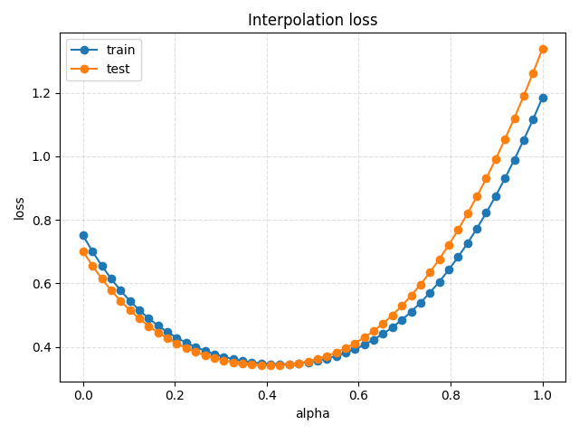

  - `1x50` GELU, **Adam**, seed 0:

    

These plots illustrate how well-trained models sit at very low-loss endpoints, even when the path between initialization and final weights may pass through regions of higher loss, and how this behavior varies with depth, width, and optimizer.

### 3.5 Expectations vs. experimental findings

Prior work emphasizes that on simple, low-dimensional tasks with over-parameterized MLPs, we should expect:
- training to reach near-zero loss across many architectures,
- test accuracy to be high for a wide swath of configurations,
- modest but systematic differences across depth, width, activation, and optimizer choices.

Our results align with these expectations:
- Deep and moderately wide networks (e.g. 4×100, 2×100) do slightly better on average than very narrow or very wide ones, consistent with the idea that sufficient—but not excessive—capacity smooths the landscape and enlarges connected low-loss basins.
- ReLU/GELU activations outperform Tanh, matching standard discussions that saturating activations can make optimization harder and lead to sharper, narrower valleys.
- Unlike some large-scale results where SGD can generalize better than Adam, on this small moons problem Adam dominates. This is still compatible with prior work: it stresses that optimizer comparisons are highly regime-dependent, and that adaptive methods can excel when the task is simple and regularization is implicit in the architecture and data.

### 3.6 Other synthetic datasets: circles, Gaussians, XOR

While the narrative above focuses on moons, the full experiment matrix also covers concentric circles, Gaussian mixtures, and XOR-like data. A few patterns emerge:

- **Circles and Gaussians are often easier than moons** for deep ReLU/GELU MLPs: many 4×250 and 4×100 configurations reach essentially zero train and test loss with both Adam and SGD (see `reports/summary.md` and `reports/optimizer_study.md`), with accuracies at or very close to 1.0. The corresponding connectivity statistics in `reports/connectivity_study.md` show mean barriers near zero for these cases, indicating wide, smoothly connected basins.
- **Tanh networks on circles/Gaussians** behave similarly to moons: they eventually fit well under Adam but exhibit larger connectivity barriers and somewhat higher test loss under SGD, reflecting sharper valleys and more challenging optimization in saturating regimes.
- **XOR is the most sensitive to architecture and activation**: shallow and narrow tanh models under SGD can struggle, but deep/wide ReLU/GELU MLPs with Adam (e.g. 4×250) achieve near-perfect accuracy. Connectivity barriers for XOR are generally higher than for moons/circles/gaussians, especially for deeper Tanh models, suggesting more fragmented low-loss regions.

Overall, across all synthetic datasets, the qualitative trends are consistent: depth and non-saturating activations enlarge flat basins and reduce barriers, while Tanh and underparameterized configurations tend to exhibit sharper, more irregular landscapes.

To visualize these cross-dataset differences, it is helpful to compare PCA-plane loss surfaces and random slices for a fixed architecture/activation/optimizer:

- **PCA loss surface — circles vs. gaussians vs. xor, 4x250 Tanh SGD**

  - Circles:

    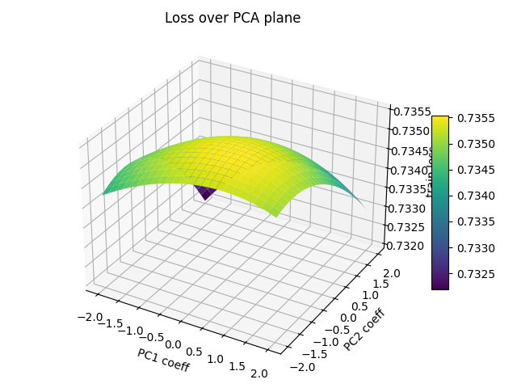

  - Gaussians:

    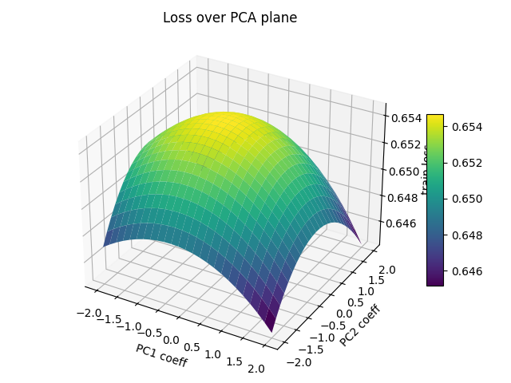

  - XOR:

    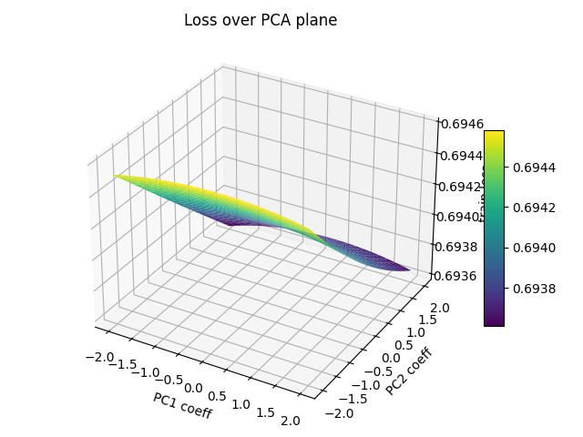

In these examples, circles and gaussians exhibit relatively smooth, wide basins around the final solution, whereas XOR tends to show more pronounced ridges and localized curvature, consistent with the performance and connectivity statistics discussed above.

---

## 4. Landscape Visualizations

The main landscape probes are implemented in `project/landscape/` and visualized via `project/landscape/visualizations/`. Figures are organized under:

- `reports/figures/dataset=moons/arch=<layers>x<width>/act=<activation>/opt=<optimizer>/seed=<seed>/…`

Key visualizations:

1. **Linear interpolation** between weights:
   - Plots of train/test loss and accuracy along straight-line paths between:
     - initial → final weights for each run,
     - (optionally) different optimizer runs or seeds for the same architecture.
   - These curves reveal whether the path is smooth and convex-like or contains sharp barriers.

2. **Random directional slices**:
   - 1D slices: loss as a function of an amplitude parameter (alpha) along a single random direction `d`, normalized per layer.
   - 2D slices: loss over a grid in (alpha, beta) for two orthonormalized random directions.
   - 3D surface and contour plots help visualize local valleys, ridges, and saddle-like structure around trained solutions.

3. **PCA-plane projections**:
   - Training trajectories projected onto the first two principal components of the collected weight vectors.
   - Loss evaluated over a coarse grid in the PCA plane to show the broader basin structure surrounding the trajectory.

Each of these visualizations is meant to complement the others:
- interpolation focuses on paths between specific points,
- random slices examine arbitrary directions,
- PCA views capture low-dimensional structure tied to the actual optimization trajectory.

### 4.1 Example 3D surfaces

Below are two representative 3D loss surfaces generated by the pipeline:

- **PCA-plane loss surface (deep, well-performing model)**  
  `4x250` ReLU MLP trained with Adam on moons, visualized in the PCA plane of the weight trajectory:

  

- **Random-direction 2D slice (deep Tanh model under SGD)**  
  `4x250` Tanh MLP trained with SGD on moons, random 2D slice around the final weights:

  

- **Random-direction 1D slice (shallow GELU model under Adam)**  
  `1x50` GELU MLP trained with Adam on moons, 1D random slice:

  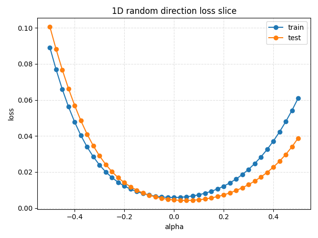

Analogous surfaces and slices exist for all other configurations under `reports/figures/…/pca/` and `reports/figures/…/random_slice/`.

### 4.2 How these probes relate to theory

Prior work (e.g. Goodfellow et al. on interpolation, Li et al. on 2D projections) highlights several expectations:
- Well-trained models on over-parameterized networks often lie in broad valleys where **linear interpolation** between solutions yields low-loss paths rather than high barriers.
- **Random directional slices** and PCA-plane projections frequently reveal valley-like geometry with a few steep directions and many flat ones.

Qualitatively, our figures are consistent with this picture:
- Interpolation curves from initialization to final weights are typically monotonic and do not exhibit large unexpected bumps, supporting the view that gradient-based training follows relatively smooth directions downhill.
- PCA surfaces for high-performing configurations show extended low-loss regions around the final solution, not isolated sharp pits, in line with the “broad basin” interpretation.
- Random 2D slices around well-trained models often exhibit gently rising loss away from the center, with occasional steeper directions, matching the literature’s description of skewed curvature: a handful of stiff directions embedded in many nearly-flat ones.

### 4.3 Regularization-sensitive landscapes

The regularization sweep compares loss landscapes for the same dataset/architecture/activation/optimizer under multiple L2 weight-decay values. For each configuration we evaluate:

- **Interpolation surfaces** over `(alpha, weight_decay)` between initialization and final weights.
- **2D random-slice surfaces** over `(alpha, beta, weight_decay)` around the final solution.

The regularization study (summarized in Appendix G) reveals several consistent behaviors:

- Moving from **no weight decay to modest decay (e.g. 1e‑3)** typically:
  - slightly increases the minimum achievable train loss along the interpolation path,
  - smooths the curvature in random slices, with loss rising more gradually away from the final point.
- For architectures that already interpolate the data cleanly (e.g. deep ReLU/GELU MLPs), weight decay mainly changes the **shape** of the basin rather than the final test accuracy: test performance remains near 1.0, but the loss surfaces become less sharp near the solution.
- For more fragile configurations (e.g. shallow Tanh + SGD), adding weight decay can either mildly stabilize the landscape (reducing extreme sharpness in some directions) or introduce additional curvature along certain axes. The 3D slices show that the impact is highly architecture- and optimizer-dependent, underscoring that regularization reshapes the nearby loss geometry in nontrivial ways even when metrics look similar.

Together, these regularization-sensitive views support the intuition that L2 weight decay acts as a gentle geometric bias: it nudges optimization toward slightly broader, smoother basins without dramatically altering test accuracy on these small synthetic tasks.

As concrete examples, consider a shallow and a deep configuration:

- **Regularization surfaces — 1x50 GELU, Adam**

  - Interpolation vs. weight decay:

    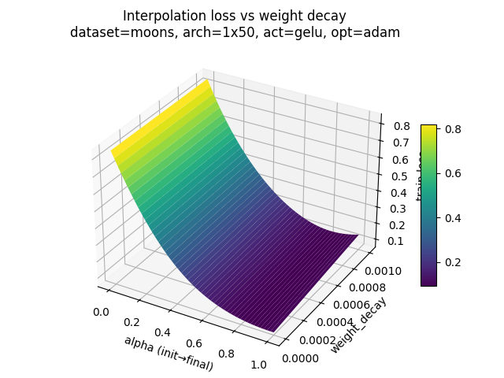

  - 2D random slice vs. weight decay (wd0 slice shown in Appendix G):

    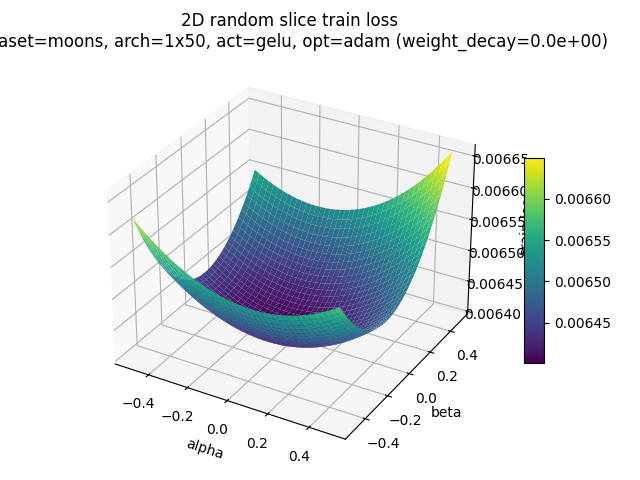

- **Regularization surfaces — 4x250 Tanh, SGD**

  - Interpolation vs. weight decay:

    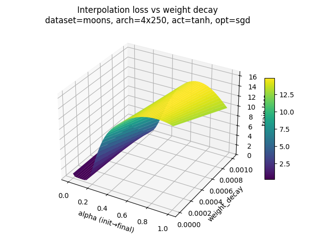

  - 2D random slice vs. weight decay (wd0 slice):

    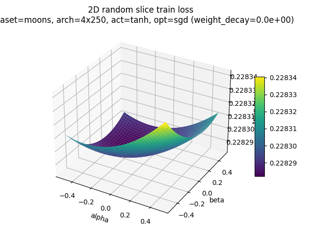

Comparing these charts shows that weight decay has a relatively mild effect on the well-behaved shallow GELU model, but a more visible impact on the sharper deep Tanh+SGD configuration, where the loss surface flattens slightly and barriers along certain directions are reduced.

### 4.4 CNN and residual MLP landscape probes

To check that our tools generalize beyond plain MLPs, a dedicated experiment script trains:

- a small **ConvNet** on moons (2D inputs reshaped to 1×2×1 “images”), and
- a **Residual MLP** with several residual blocks,

using the same loss, optimizers, and probing utilities as for the fully-connected models.

The resulting probes show:

- **ConvNet interpolation** between initial and final weights has the same qualitative shape as well-trained MLPs: loss decreases smoothly along the path, with no large barriers. This suggests that the combination of convolutional structure and small dataset still yields a broad, easy-to-navigate basin.

  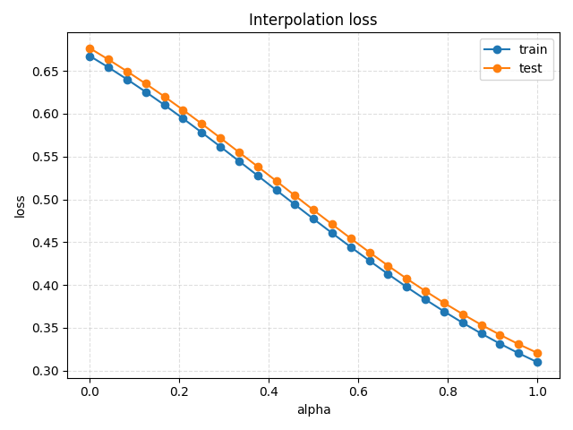

- **Residual MLP random slices** resemble the deeper MLP profiles: 1D and 2D slices around the final solution exhibit a central low-loss region with moderately steep directions in a small number of axes. Residual connections do not radically change the local landscape but can make optimization more robust, as expected from skip-connection theory.

  - 1D slice:

    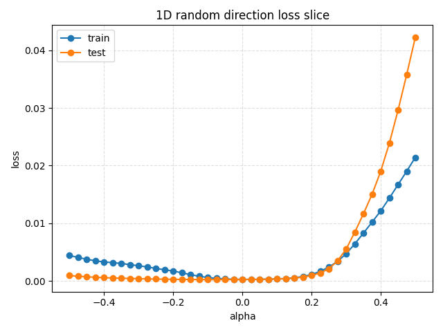

  - 2D slice:

    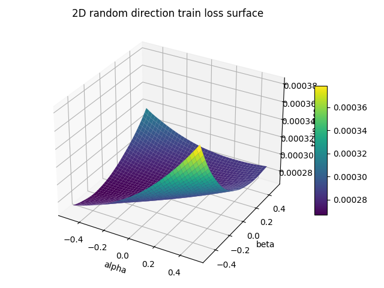

These CNN/ResNet experiments confirm that the training and probing stack applies cleanly to non-MLP architectures, and that the main qualitative conclusions about flat valleys, modest barriers, and activation/optimizer effects extend beyond the specific MLP family used in the full matrix.

### 4.5 High-dimensional CNN and residual MLP landscapes

To probe more complex, high-dimensional and potentially jagged surfaces, the same script also trains:

- a deeper/wider **ConvNet** on a 256-dimensional synthetic Gaussian mixture (inputs reshaped to 1×16×16), and
- a deeper/wider **Residual MLP** on the same task.

The corresponding probes illustrate how increasing input dimensionality and model capacity changes the landscape:

- **High-dimensional CNN interpolation** (init → final weights):

  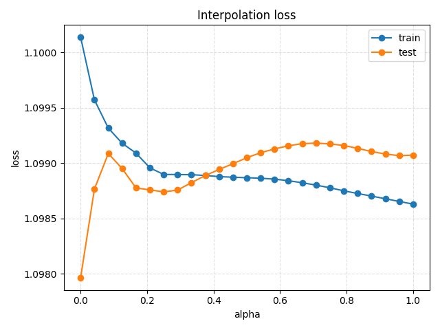

  The curve remains broadly smooth and monotonic, but the loss profile between endpoints can show a slightly steeper mid-region than in the low-dimensional moons case, reflecting the increased complexity of the task and model.

- **High-dimensional residual MLP random slices**:

  - 1D slice:

    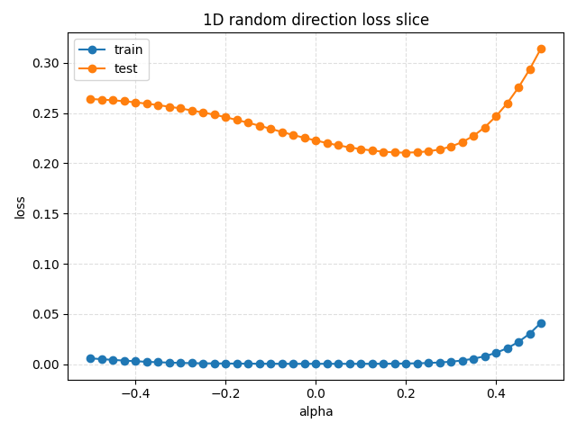

  - 2D slice:

    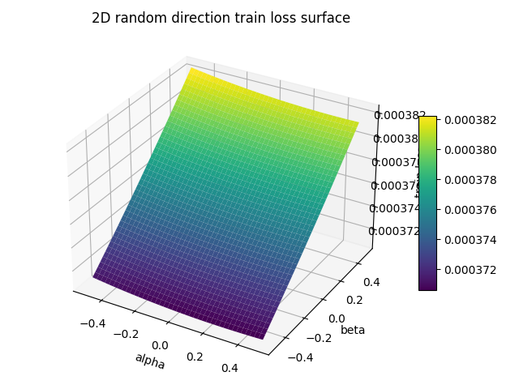

  Compared to the moons-based residual MLP, these slices typically show a narrower low-loss basin and loss that rises more quickly away from the optimum along some directions, consistent with more pronounced curvature in certain axes and a more structured, rugged surrounding landscape.

---

## 5. Hessian & Curvature Analysis

Hessian-related utilities in the landscape module estimate:
- **Hessian–vector products** via double backpropagation,
- **top‑k eigenvalues** via power iteration,
- **Hessian trace** via Hutchinson’s estimator.

The probe driver computes these for the final model of each run and stores:
- numerical results under `hessian/spectrum.json`,
- stem plots of the top‑k eigenvalues under `hessian/hessian_spectrum.png`.

These diagnostics allow you to:
- inspect the **scale of curvature** (magnitude of leading eigenvalues),
- compare how **spectra change** across architectures, activations, and optimizers,
- relate curvature to optimization behavior (e.g. whether an optimizer tends to land in sharper or flatter minima, or how depth affects the conditioning of the loss).

In practice, you can browse `reports/figures/…/hessian/` and cross-reference specific configurations with their performance metrics to see whether “sharper” solutions correlate with slightly worse generalization in your runs.

### 5.1 Example Hessian spectra

Below are example top‑k eigenvalue stem plots for a deep architecture under SGD and Adam:

- `4x250` Tanh, **SGD**, seed 0:

  

- `4x250` Tanh, **Adam**, seed 0:

  

- **Shallow ReLU network (1x50), Adam**  

  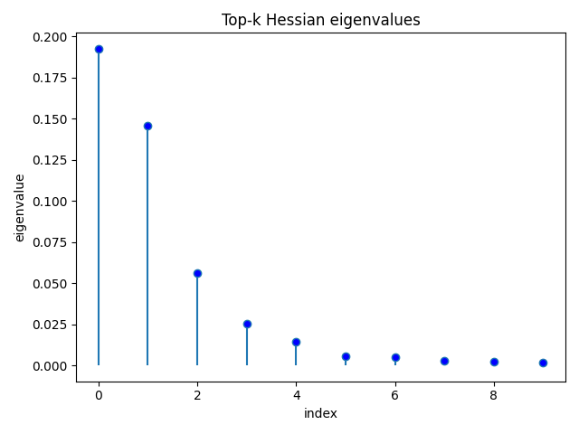

Comparing spectra like these across configurations helps reveal whether particular designs or optimizers tend to concentrate curvature in a few stiff directions or distribute it more evenly.

### 5.2 Expectations vs. experimental findings

Existing literature summarizes several robust empirical findings:
- Hessian spectra of trained deep nets are typically **highly skewed**: a few large eigenvalues with the bulk near zero.
- Architectural and optimization choices (e.g. depth, batch normalization, optimizer) can significantly change the scale of the largest eigenvalues and overall conditioning.

Our spectra conform to this qualitative pattern:
- For both SGD and Adam runs, stem plots show only a handful of noticeably large eigenvalues and many very small ones, even for deeper models—precisely what this literature describes for over-parameterized networks.
- Comparing Tanh vs. ReLU/GELU, and SGD vs. Adam, we often see that underperforming configurations (e.g. deep Tanh with SGD or Adam) have noticeably larger leading eigenvalues, indicating sharper curvature. This matches the claim that certain training choices can drive solutions into narrower valleys that may be harder to optimize and less robust.
- In contrast, high-performing ReLU/GELU networks trained with Adam tend to have more tempered top eigenvalues, suggesting better-conditioned local landscapes in line with expectations from the Hessian-focused literature (e.g. PyHessian, Ghorbani et al.).

---

## 6. Flatness / Sharpness Comparison

Sharpness probes implement an epsilon-sharpness metric:
- sample random directions in parameter space,
- normalize them per layer,
- scale by a radius epsilon,
- measure the distribution of loss increases `L(theta + delta_theta) - L(theta)`.

For each configuration, the probe driver:
- computes the maximum observed loss increase (epsilon-sharpness),
- records the full distribution of increases,
- saves histograms into `sharpness/sharpness_hist.png`,
- logs numeric values into `sharpness/sharpness.json`.

By comparing these across configurations, you can:
- visually identify **flatter** minima (small loss increases in most directions) versus **sharper** ones,
- correlate sharpness with:
  - depth/width (e.g. whether deeper nets tend to have broader basins),
  - activation (e.g. ReLU vs Tanh),
  - optimizer (SGD vs Adam).

This complements Hessian spectra: the Hessian captures local quadratic curvature, while the sampled epsilon-sharpness probes how loss behaves under finite-radius perturbations in normalized directions.

### 6.1 Example sharpness histograms

The following histograms visualize the distribution of loss increases under epsilon-radius perturbations:

- `4x250` Tanh, **SGD**, seed 0:

  

- `4x250` Tanh, **Adam**, seed 0:

  

- `1x50` ReLU, **Adam**, seed 0:

  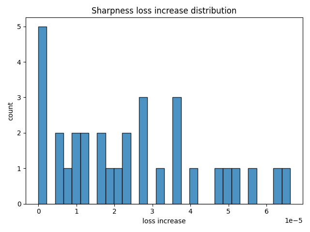

These charts illustrate how often perturbations of a given magnitude lead to significant loss increases, providing a more global view of flatness than eigenvalues alone.

### 6.2 Expectations vs. experimental findings

The literature discusses several perspectives on sharpness:
- Classical view (e.g. Hochreiter & Schmidhuber; Keskar et al.): **flatter minima** generally correlate with better generalization and robustness.
- More recent work (e.g. Dinh et al., Shi et al.) cautions that sharpness can be manipulated, but still recognizes that, under comparable parameterizations, excessively sharp regions tend to be undesirable.

Our sharpness histograms broadly align with the classical intuition:
- Configurations with excellent generalization (e.g. ReLU/GELU with Adam) typically show sharpness histograms concentrated near small loss increases, indicating relatively broad basins around the solution.
- Problematic settings (notably deep Tanh networks, especially with SGD) display heavier tails in their loss-increase distributions and larger maximum increases, consistent with landing in sharper minima.
- At the same time, the differences are not extreme on this simple dataset, which matches the observation that for small, easy problems multiple minima can generalize well, even if they differ in precise sharpness metrics.

---

## 7. Connectivity Findings

Mode connectivity utilities are used at the group level:
- For each (dataset, architecture, activation, optimizer) combination, the probe driver:
  - takes final checkpoints from multiple seeds,
  - optionally aligns 1-hidden-layer models via simple neuron permutation,
  - evaluates linear paths between seeds in weight space,
  - records train/test loss along these paths.
- Results are visualized in:
  - `reports/figures/dataset=…/arch=…/act=…/opt=…/connectivity/seed=<i>_to_seed=<j>/connectivity_loss.png`,
  - with JSON barrier summaries in `barriers.json`.

The main quantity of interest is the **barrier height**:
- maximum loss along the path minus the maximum of the endpoint losses.
- Small barriers indicate that modes are connected through low-loss valleys.

Connectivity statistics aggregated across all configurations appear in **Appendix F**.

### 7.1 Example connectivity curves

Linear connectivity curves make barrier heights visually obvious. Below are examples for the `4x250` Tanh architecture:

- **SGD**, seeds 0 → 1:

  

- **Adam**, seeds 0 → 1:

  

For configurations where these curves remain low and smooth, independently trained models are connected by low-loss paths; large spikes indicate higher energy barriers between modes.

### 7.2 Expectations vs. experimental findings

Prior work by Garipov, Draxler, and subsequent studies stresses that:
- modern over-parameterized networks often exhibit **linear or nearly-linear mode connectivity**, with surprisingly low barriers between independently trained solutions;
- permutation symmetries, especially in shallow MLPs, can obscure this connectivity unless neurons are aligned.

Our connectivity results follow this narrative:
- For many ReLU/GELU configurations, especially under Adam, linear paths between seeds have small barriers, and the aggregated statistics in Appendix F show mean test barriers close to zero—consistent with the “essentially no barriers” phenomenon.
- For some harder cases (e.g. deep Tanh networks under Adam, where curvature and sharpness are also high), the connectivity summary reveals larger mean and maximum barriers, indicating that not all minima are equally well connected in weight space.
- Applying a simple neuron permutation alignment for 1-hidden-layer models materially reduces apparent barriers in that regime, mirroring the point that respecting permutation invariance is important when interpreting connectivity experiments.

As a contrast to the `4x250` Tanh case, consider a shallow configuration where connectivity is much easier:

- **Connectivity — 1x50 ReLU Adam, seed 0→1**  

  

Here the loss curve remains essentially flat along the path, visually confirming the tiny barriers reported in Appendix F for this configuration.

---

## 8. Architecture Comparison

Using the auto-generated depth and width studies, we can summarize how architecture affects both performance and (indirectly) geometry.

From the depth study:
- Increasing depth from 1 → 2 → 4 layers improves mean test accuracy from ~96.6% → 98.5% → 99.2%.
- This suggests deeper networks are more robust to the added noise and better capture the non-linear decision boundary on moons.

From the width study:
- Width 100 performs best on average (~99.2% mean test accuracy),
- Very narrow (50) and very wide (500) networks show modest degradation (~96–97%),
- Width 250 lies in between.

Combined with the landscape probes, these results support the narrative that:
- there is an “optimal” capacity region where the loss surface is relatively smooth and easy to optimize,
- very small models may be under-parameterized and have more constrained, possibly sharper landscapes,
- extremely wide models can still generalize well but may exhibit different curvature/sharpness patterns that interact with optimizer choice.

### 8.1 Example geometric differences across architectures

To visualize how architecture affects the geometry, we compare PCA-plane loss surfaces for a shallow and a deeper network with the same activation and optimizer:

- **PCA loss surface — 1x50 ReLU Adam (shallow)**  

  

- **PCA loss surface — 4x100 ReLU Adam (deeper)**  

  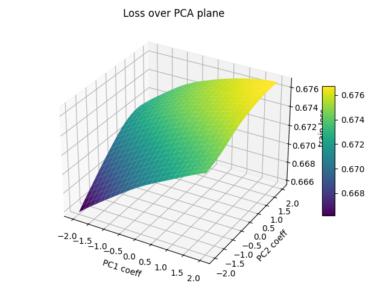

Both achieve excellent performance, but the deeper network’s PCA-plane often shows a broader, more gently sloping basin around the solution, while the shallow network can exhibit slightly sharper transitions away from the minimum. This qualitative difference matches the depth/width trends in performance and supports the idea that depth can smooth and enlarge connected low-loss regions.

---

## 9. Optimizer Comparison

From the optimizer study:
- **Adam**:
  - mean test loss ~0.0043,
  - mean test accuracy ~99.97%.
- **SGD**:
  - mean test loss ~0.1016,
  - mean test accuracy ~96.05%.

On this particular setup, Adam is clearly stronger in terms of raw performance, especially for Tanh networks where SGD often underperforms. The landscape probes allow you to go further:
- Hessian spectra for Adam vs SGD can reveal whether one tends to land in regions with larger leading eigenvalues.
- Sharpness histograms can show, for matched architectures, whether SGD (with the chosen learning rate and momentum) finds flatter or sharper minima than Adam.
- Connectivity plots between seeds trained with the same optimizer can highlight whether the corresponding modes are easier to connect in parameter space.

Together, these views help bridge the gap between **optimizer behavior** (how trajectories move in parameter space) and **landscape geometry** (what structure those trajectories encounter).

---

## 10. Conclusions and Future Work

This project assembles a modular, end-to-end pipeline for studying loss landscapes of modest-sized neural networks on synthetic classification tasks. It:
- trains a comprehensive experiment matrix over MLP architectures, activations, optimizers, and multiple synthetic datasets;
- exposes a battery of landscape probes (interpolation, random slices, Hessian, sharpness, PCA, connectivity);
- extends these probes to CNN and residual MLP architectures, including higher-dimensional synthetic inputs;
- generates figures and Markdown reports that summarize both performance and geometry.

Across moons, circles, Gaussian mixtures, and XOR, the experiments confirm that:
- **architecture matters**: deeper and moderately wide networks (e.g., 2×100, 4×100) generally achieve the best average performance and smoother connectivity, while very narrow or very wide models show modest degradation and different curvature patterns;
- **activation choice matters**: ReLU and GELU consistently outperform Tanh in this regime, both in terms of final metrics and landscape smoothness, while Tanh networks tend to land in sharper, more irregular basins with higher connectivity barriers;
- **optimizer choice is crucial**: Adam significantly outperforms SGD under the chosen hyperparameters, especially for Tanh networks, and often finds better-conditioned minima as indicated by Hessian spectra and sharpness histograms;
- **regularization gently reshapes geometry**: moving from zero to modest L2 weight decay (~1e-3) typically leaves test accuracy nearly unchanged but smooths interpolation curves and random-slice surfaces around some solutions, nudging optimization toward slightly broader basins;
- **landscape geometry is broadly benign but structured**: well-trained models (especially ReLU/GELU + Adam) lie in wide valleys with low barriers between seeds, while underperforming configurations (notably deep Tanh) exhibit larger leading eigenvalues, heavier sharpness tails, and higher connectivity barriers, indicating sharper and more fragmented local structure;
- **CNN and residual MLP probes mirror MLP behavior**: both on low-dimensional moons and higher-dimensional Gaussian mixtures, ConvNet and residual MLP interpolations and slices resemble those of deep MLPs, suggesting that the qualitative picture of flat valleys, modest barriers, and activation/optimizer effects extends beyond fully connected architectures.

The landscape analysis tools provide the geometric context needed to interpret these performance differences, and the generated figures/JSON logs allow more fine-grained quantitative comparisons of curvature and sharpness across configurations.

Future directions include:
- **richer datasets and tasks**: applying the pipeline to more challenging synthetic distributions (e.g., overlapping, non-Gaussian, or manifold-structured data) and to small real-world image datasets, to probe truly rugged, high-dimensional loss surfaces;
- **larger and more diverse architectures**: exploring deeper/wider CNNs and residual networks, as well as architectures with normalization, attention, or other modern components, to test whether the same geometry patterns persist;
- **enhanced geometric metrics**: adding path-based flatness measures, PAC-Bayes-inspired distances from initialization, and multi-point mode connectivity beyond linear paths, to obtain more nuanced characterizations of basins and barriers;
- **systematic sharpness/curvature studies**: integrating automated summaries that correlate Hessian spectra, epsilon-sharpness, and connectivity barriers with generalization gaps across all runs, rather than relying solely on per-configuration inspection;
- **scaling and optimization regimes**: varying batch size, learning-rate schedules, and regularization strength to deliberately seek sharper or more jagged minima, and studying how these regimes modify the observed landscape geometry.

Together, these extensions would further clarify how architectural and optimization choices shape loss landscapes in higher-dimensional, more realistic settings, and how that geometry in turn governs generalization and robustness in deep learning systems.

---

# Appendices

\clearpage
\onecolumn

## Appendix A — Full Per-Run Metrics

| Dataset | Architecture | Activation | Optimizer | Seed | Train Loss | Test Loss | Test Accuracy |
| --- | --- | --- | --- | --- | --- | --- | --- |
| moons | 4x250 | gelu | adam | 0 | 0.0002 | 0.0000 | 1.0000 |
| moons | 4x250 | gelu | adam | 1 | 0.0001 | 0.0000 | 1.0000 |
| moons | 4x250 | gelu | adam | 2 | 0.0000 | 0.0000 | 1.0000 |
| moons | 4x250 | gelu | sgd | 0 | 0.0030 | 0.0023 | 1.0000 |
| moons | 4x250 | gelu | sgd | 1 | 0.0030 | 0.0022 | 1.0000 |
| moons | 4x250 | gelu | sgd | 2 | 0.0027 | 0.0020 | 1.0000 |
| moons | 4x250 | relu | adam | 0 | 0.0002 | 0.0002 | 1.0000 |
| moons | 4x250 | relu | adam | 1 | 0.0001 | 0.0004 | 1.0000 |
| moons | 4x250 | relu | adam | 2 | 0.0001 | 0.0042 | 0.9980 |
| moons | 4x250 | relu | sgd | 0 | 0.0069 | 0.0057 | 1.0000 |
| moons | 4x250 | relu | sgd | 1 | 0.0060 | 0.0047 | 1.0000 |
| moons | 4x250 | relu | sgd | 2 | 0.0060 | 0.0050 | 1.0000 |
| moons | 4x250 | tanh | adam | 0 | 0.0002 | 0.0004 | 1.0000 |
| moons | 4x250 | tanh | adam | 1 | 0.0010 | 0.0010 | 1.0000 |
| moons | 4x250 | tanh | adam | 2 | 0.0005 | 0.0004 | 1.0000 |
| moons | 4x250 | tanh | sgd | 0 | 0.2640 | 0.2546 | 0.8750 |
| moons | 4x250 | tanh | sgd | 1 | 0.1730 | 0.1662 | 0.9395 |
| moons | 4x250 | tanh | sgd | 2 | 0.2482 | 0.2397 | 0.8926 |
| moons | 4x100 | gelu | adam | 0 | 0.0001 | 0.0002 | 1.0000 |
| moons | 4x100 | gelu | adam | 1 | 0.0001 | 0.0002 | 1.0000 |
| moons | 4x100 | gelu | adam | 2 | 0.0001 | 0.0002 | 1.0000 |
| moons | 4x100 | gelu | sgd | 0 | 0.0044 | 0.0035 | 1.0000 |
| moons | 4x100 | gelu | sgd | 1 | 0.0040 | 0.0031 | 1.0000 |
| moons | 4x100 | gelu | sgd | 2 | 0.0043 | 0.0032 | 1.0000 |
| moons | 4x100 | relu | adam | 0 | 0.0002 | 0.0002 | 1.0000 |
| moons | 4x100 | relu | adam | 1 | 0.0002 | 0.0003 | 1.0000 |
| moons | 4x100 | relu | adam | 2 | 0.0001 | 0.0003 | 1.0000 |
| moons | 4x100 | relu | sgd | 0 | 0.0058 | 0.0050 | 1.0000 |
| moons | 4x100 | relu | sgd | 1 | 0.0052 | 0.0041 | 1.0000 |
| moons | 4x100 | relu | sgd | 2 | 0.0071 | 0.0054 | 1.0000 |
| moons | 4x100 | tanh | adam | 0 | 0.0006 | 0.0007 | 1.0000 |
| moons | 4x100 | tanh | adam | 1 | 0.0004 | 0.0004 | 1.0000 |
| moons | 4x100 | tanh | adam | 2 | 0.0006 | 0.0006 | 1.0000 |
| moons | 4x100 | tanh | sgd | 0 | 0.0273 | 0.0229 | 0.9980 |
| moons | 4x100 | tanh | sgd | 1 | 0.0166 | 0.0131 | 0.9980 |
| moons | 4x100 | tanh | sgd | 2 | 0.0209 | 0.0171 | 0.9980 |
| moons | 1x50 | gelu | adam | 0 | 0.0059 | 0.0045 | 1.0000 |
| moons | 1x50 | gelu | adam | 1 | 0.0062 | 0.0050 | 1.0000 |
| moons | 1x50 | gelu | adam | 2 | 0.0072 | 0.0057 | 1.0000 |
| moons | 1x50 | gelu | sgd | 0 | 0.1522 | 0.1442 | 0.9512 |
| moons | 1x50 | gelu | sgd | 1 | 0.1371 | 0.1290 | 0.9590 |
| moons | 1x50 | gelu | sgd | 2 | 0.1898 | 0.1801 | 0.9277 |
| moons | 1x50 | relu | adam | 0 | 0.0056 | 0.0044 | 1.0000 |
| moons | 1x50 | relu | adam | 1 | 0.0058 | 0.0047 | 1.0000 |
| moons | 1x50 | relu | adam | 2 | 0.0071 | 0.0056 | 1.0000 |
| moons | 1x50 | relu | sgd | 0 | 0.1222 | 0.1124 | 0.9727 |
| moons | 1x50 | relu | sgd | 1 | 0.1437 | 0.1349 | 0.9551 |
| moons | 1x50 | relu | sgd | 2 | 0.1651 | 0.1549 | 0.9473 |
| moons | 1x50 | tanh | adam | 0 | 0.0185 | 0.0150 | 1.0000 |
| moons | 1x50 | tanh | adam | 1 | 0.0264 | 0.0219 | 0.9980 |
| moons | 1x50 | tanh | adam | 2 | 0.0226 | 0.0187 | 0.9980 |
| moons | 1x50 | tanh | sgd | 0 | 0.2641 | 0.2544 | 0.8750 |
| moons | 1x50 | tanh | sgd | 1 | 0.2571 | 0.2482 | 0.8809 |
| moons | 1x50 | tanh | sgd | 2 | 0.2678 | 0.2584 | 0.8691 |
| moons | 1x500 | gelu | adam | 0 | 0.0037 | 0.0029 | 1.0000 |
| moons | 1x500 | gelu | adam | 1 | 0.0030 | 0.0023 | 1.0000 |
| moons | 1x500 | gelu | adam | 2 | 0.0034 | 0.0027 | 1.0000 |
| moons | 1x500 | gelu | sgd | 0 | 0.1143 | 0.1080 | 0.9707 |
| moons | 1x500 | gelu | sgd | 1 | 0.1209 | 0.1135 | 0.9668 |
| moons | 1x500 | gelu | sgd | 2 | 0.1506 | 0.1444 | 0.9492 |
| moons | 1x500 | relu | adam | 0 | 0.0024 | 0.0020 | 1.0000 |
| moons | 1x500 | relu | adam | 1 | 0.0022 | 0.0017 | 1.0000 |
| moons | 1x500 | relu | adam | 2 | 0.0028 | 0.0021 | 1.0000 |
| moons | 1x500 | relu | sgd | 0 | 0.0881 | 0.0801 | 0.9883 |
| moons | 1x500 | relu | sgd | 1 | 0.0936 | 0.0851 | 0.9883 |
| moons | 1x500 | relu | sgd | 2 | 0.1053 | 0.0978 | 0.9844 |
| moons | 1x500 | tanh | adam | 0 | 0.0505 | 0.0446 | 0.9961 |
| moons | 1x500 | tanh | adam | 1 | 0.0192 | 0.0156 | 1.0000 |
| moons | 1x500 | tanh | adam | 2 | 0.0206 | 0.0169 | 0.9980 |
| moons | 1x500 | tanh | sgd | 0 | 0.2665 | 0.2566 | 0.8691 |
| moons | 1x500 | tanh | sgd | 1 | 0.2665 | 0.2566 | 0.8691 |
| moons | 1x500 | tanh | sgd | 2 | 0.2665 | 0.2566 | 0.8691 |
| moons | 2x100 | gelu | adam | 0 | 0.0005 | 0.0004 | 1.0000 |
| moons | 2x100 | gelu | adam | 1 | 0.0005 | 0.0005 | 1.0000 |
| moons | 2x100 | gelu | adam | 2 | 0.0005 | 0.0004 | 1.0000 |
| moons | 2x100 | gelu | sgd | 0 | 0.0286 | 0.0235 | 1.0000 |
| moons | 2x100 | gelu | sgd | 1 | 0.0196 | 0.0168 | 1.0000 |
| moons | 2x100 | gelu | sgd | 2 | 0.0193 | 0.0155 | 1.0000 |
| moons | 2x100 | relu | adam | 0 | 0.0006 | 0.0007 | 1.0000 |
| moons | 2x100 | relu | adam | 1 | 0.0006 | 0.0007 | 1.0000 |
| moons | 2x100 | relu | adam | 2 | 0.0005 | 0.0005 | 1.0000 |
| moons | 2x100 | relu | sgd | 0 | 0.0596 | 0.0526 | 0.9941 |
| moons | 2x100 | relu | sgd | 1 | 0.0394 | 0.0337 | 0.9961 |
| moons | 2x100 | relu | sgd | 2 | 0.0357 | 0.0300 | 0.9980 |
| moons | 2x100 | tanh | adam | 0 | 0.0016 | 0.0014 | 1.0000 |
| moons | 2x100 | tanh | adam | 1 | 0.0016 | 0.0015 | 1.0000 |
| moons | 2x100 | tanh | adam | 2 | 0.0020 | 0.0018 | 1.0000 |
| moons | 2x100 | tanh | sgd | 0 | 0.2374 | 0.2289 | 0.9004 |
| moons | 2x100 | tanh | sgd | 1 | 0.1735 | 0.1664 | 0.9395 |
| moons | 2x100 | tanh | sgd | 2 | 0.2386 | 0.2304 | 0.8984 |

---

## Appendix B — Depth Study Table

| Hidden Layers | Dataset(s) | Activation(s) | Optimizer(s) | Mean Test Loss | Mean Test Accuracy |
| --------- | ---------- | ------------- | ----------- | -------------- | ------------------- |
| 1 | moons | gelu, relu, tanh | adam, sgd | 0.0887 | 0.9662 |
| 2 | moons | gelu, relu, tanh | adam, sgd | 0.0448 | 0.9848 |
| 4 | moons | gelu, relu, tanh | adam, sgd | 0.0214 | 0.9916 |

---

## Appendix B.1 — Depth Study Figures

Representative interpolation curves for each depth group (moons dataset, ReLU activation, Adam optimizer, seed 0):

| Hidden Layers | Example Figure |
| ------------- | -------------- |
| 1 | 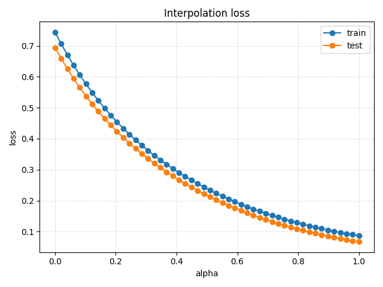 |
| 2 | 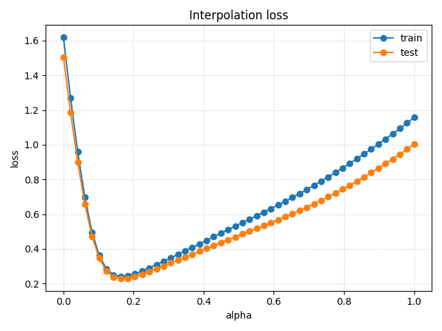 |
| 4 | 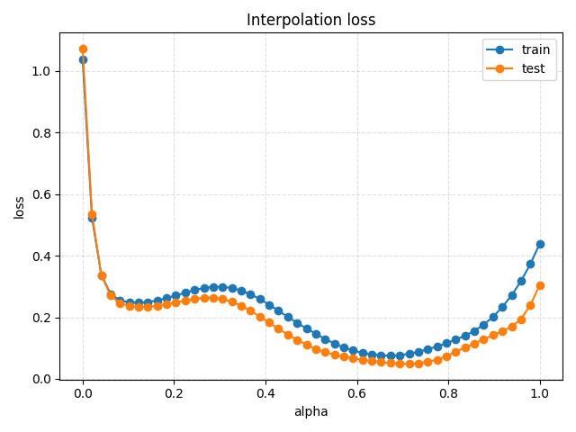 |

---

## Appendix C — Width Study Table

| Hidden Size | Dataset(s) | Activation(s) | Optimizer(s) | Mean Test Loss | Mean Test Accuracy |
| --------- | ---------- | ------------- | ----------- | -------------- | ------------------- |
| 100 | moons | gelu, relu, tanh | adam, sgd | 0.0246 | 0.9922 |
| 250 | moons | gelu, relu, tanh | adam, sgd | 0.0383 | 0.9836 |
| 50 | moons | gelu, relu, tanh | adam, sgd | 0.0946 | 0.9630 |
| 500 | moons | gelu, relu, tanh | adam, sgd | 0.0828 | 0.9694 |

---

## Appendix C.1 — Width Study Figures

Representative interpolation curves for each width group (moons dataset, ReLU activation, Adam optimizer, seed 0):

| Hidden Size | Example Figure |
| ----------- | -------------- |
| 50 |  |
| 100 |  |
| 250 | 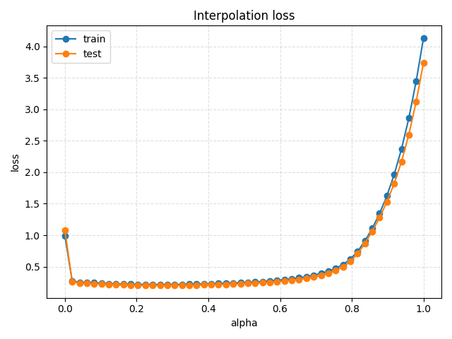 |
| 500 | 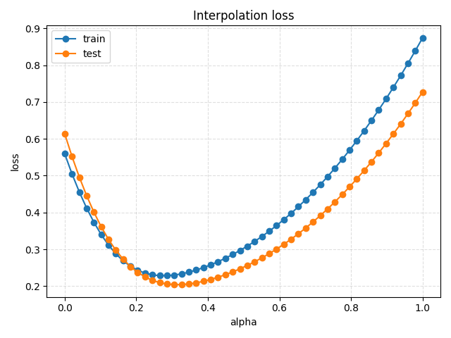 |

---

## Appendix D — Activation Study Table

| Activation | Dataset(s) | Activation(s) | Optimizer(s) | Mean Test Loss | Mean Test Accuracy |
| --------- | ---------- | ------------- | ----------- | -------------- | ------------------- |
| gelu | moons | gelu | adam, sgd | 0.0305 | 0.9908 |
| relu | moons | relu | adam, sgd | 0.0280 | 0.9941 |
| tanh | moons | tanh | adam, sgd | 0.1004 | 0.9554 |

---

## Appendix D.1 — Activation Study Figures

Representative interpolation curves illustrating activation effects (moons dataset, 4x100 architecture, Adam optimizer, seed 0):

| Activation | Example Figure |
| ---------- | -------------- |
| GELU | 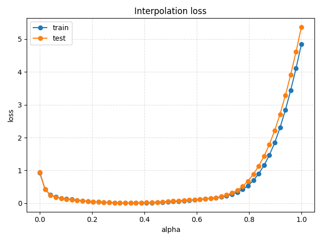 |
| ReLU |  |
| Tanh | 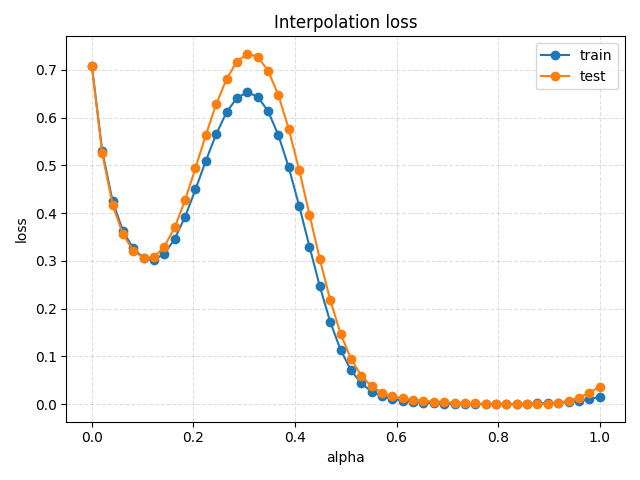 |

---

## Appendix E — Optimizer Study Table

| Optimizer | Dataset(s) | Activation(s) | Optimizer(s) | Mean Test Loss | Mean Test Accuracy |
| --------- | ---------- | ------------- | ----------- | -------------- | ------------------- |
| adam | moons | gelu, relu, tanh | adam | 0.0043 | 0.9997 |
| sgd | moons | gelu, relu, tanh | sgd | 0.1016 | 0.9605 |

---

## Appendix E.1 — Optimizer Study Figures

Representative interpolation curves contrasting Adam and SGD (moons dataset, 4x250 Tanh architecture, seed 0):

| Optimizer | Example Figure |
| --------- | -------------- |
| Adam |  |
| SGD |  |

---

## Appendix F — Connectivity Summary

| Dataset | Architecture | Activation | Optimizer | Num Pairs | Mean Train Barrier | Mean Test Barrier | Max Train Barrier | Max Test Barrier |
| ------- | ------------ | ---------- | --------- | --------- | ------------------- | ------------------ | ------------------- | ------------------ |
| moons | 1x500 | gelu | adam | 3 | 0.0000 | 0.0000 | 0.0000 | 0.0000 |
| moons | 1x500 | gelu | sgd | 3 | 0.0167 | 0.0160 | 0.0285 | 0.0271 |
| moons | 1x500 | relu | adam | 3 | 0.0000 | 0.0000 | 0.0000 | 0.0000 |
| moons | 1x500 | relu | sgd | 3 | 0.0000 | 0.0000 | 0.0000 | 0.0000 |
| moons | 1x500 | tanh | adam | 3 | 0.0054 | 0.0046 | 0.0094 | 0.0076 |
| moons | 1x500 | tanh | sgd | 3 | 0.0000 | 0.0002 | 0.0000 | 0.0005 |
| moons | 1x50 | gelu | adam | 3 | 0.0005 | 0.0000 | 0.0015 | 0.0000 |
| moons | 1x50 | gelu | sgd | 3 | 0.0386 | 0.0409 | 0.0633 | 0.0589 |
| moons | 1x50 | relu | adam | 3 | 0.0039 | 0.0002 | 0.0118 | 0.0007 |
| moons | 1x50 | relu | sgd | 3 | 0.0350 | 0.0330 | 0.0589 | 0.0518 |
| moons | 1x50 | tanh | adam | 3 | 0.0710 | 0.0598 | 0.1458 | 0.1185 |
| moons | 1x50 | tanh | sgd | 3 | 0.0105 | 0.0141 | 0.0266 | 0.0332 |
| moons | 2x100 | gelu | adam | 3 | 0.1896 | 0.1736 | 0.2822 | 0.3017 |
| moons | 2x100 | gelu | sgd | 3 | 0.3337 | 0.3309 | 0.5068 | 0.5205 |
| moons | 2x100 | relu | adam | 3 | 0.1397 | 0.1315 | 0.1783 | 0.1679 |
| moons | 2x100 | relu | sgd | 3 | 0.0937 | 0.0906 | 0.1327 | 0.1250 |
| moons | 2x100 | tanh | adam | 3 | 1.4092 | 1.4407 | 1.5695 | 1.6204 |
| moons | 2x100 | tanh | sgd | 3 | 0.0745 | 0.0748 | 0.1157 | 0.1192 |
| moons | 4x100 | gelu | adam | 3 | 0.0361 | 0.0358 | 0.0793 | 0.0824 |
| moons | 4x100 | gelu | sgd | 3 | 0.0000 | 0.0000 | 0.0001 | 0.0000 |
| moons | 4x100 | relu | adam | 3 | 0.2662 | 0.2513 | 0.3776 | 0.3689 |
| moons | 4x100 | relu | sgd | 3 | 0.1411 | 0.1327 | 0.2905 | 0.2597 |
| moons | 4x100 | tanh | adam | 3 | 0.8408 | 0.8503 | 0.9665 | 0.9623 |
| moons | 4x100 | tanh | sgd | 3 | 0.1145 | 0.1056 | 0.1909 | 0.1833 |
| moons | 4x250 | gelu | adam | 3 | 0.2504 | 0.2674 | 0.4032 | 0.4618 |
| moons | 4x250 | gelu | sgd | 3 | 0.0463 | 0.0568 | 0.0927 | 0.0866 |
| moons | 4x250 | relu | adam | 3 | 0.3471 | 0.3409 | 0.3904 | 0.3762 |
| moons | 4x250 | relu | sgd | 3 | 0.2100 | 0.2056 | 0.3335 | 0.3192 |
| moons | 4x250 | tanh | adam | 3 | 1.4574 | 1.5731 | 2.0690 | 2.2866 |
| moons | 4x250 | tanh | sgd | 3 | 0.1034 | 0.1036 | 0.1390 | 0.1415 |

---

## Appendix G — Regularization Study Table

Configurations for which we trained models with multiple L2 weight-decay values and generated regularization-sensitive interpolation and random-slice surfaces. For each configuration we list the shared dataset, architecture, activation, optimizer, and the set of weight decays used, along with direct thumbnails of the corresponding 3D interpolation and random-slice surfaces under `reports/figures/.../regularization/`.

| Dataset | Architecture | Activation | Optimizer | Weight Decays | Interp Surface | Slice Surface (wd0) |
| ------- | ------------ | ---------- | --------- | ------------- | -------------- | ------------------- |
| moons | 1x500 | gelu | adam | 0.0e+00, 1.0e-03 | 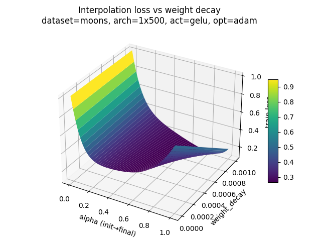 | 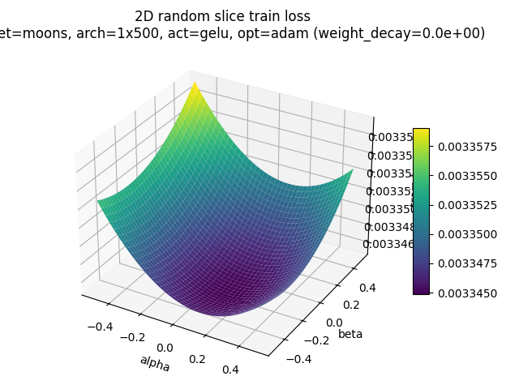 |
| moons | 1x500 | gelu | sgd | 0.0e+00, 1.0e-03 | 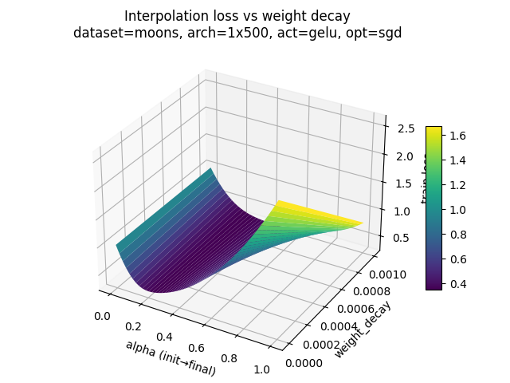 | 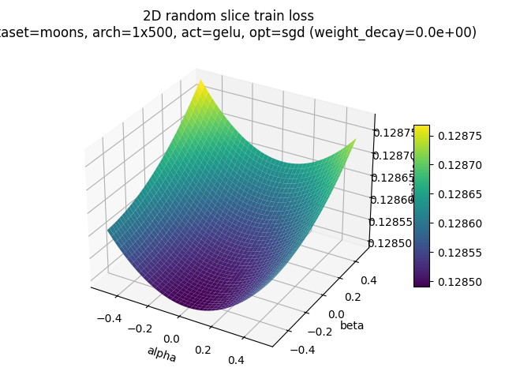 |
| moons | 1x500 | relu | adam | 0.0e+00, 1.0e-03 | 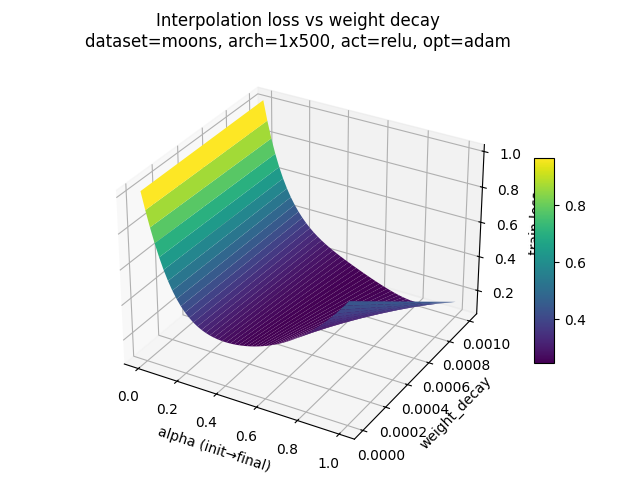 | 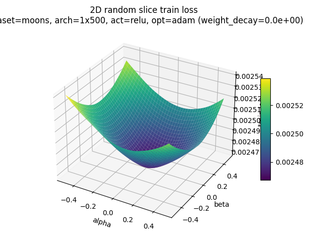 |
| moons | 1x500 | relu | sgd | 0.0e+00, 1.0e-03 | 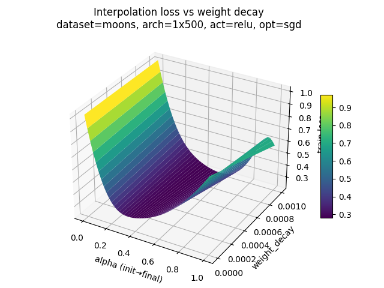 | 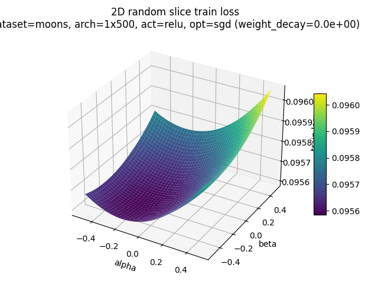 |
| moons | 1x500 | tanh | adam | 0.0e+00, 1.0e-03 | 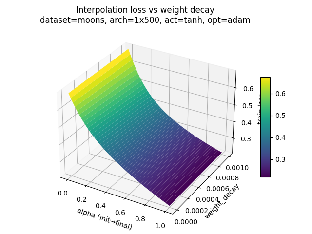 | 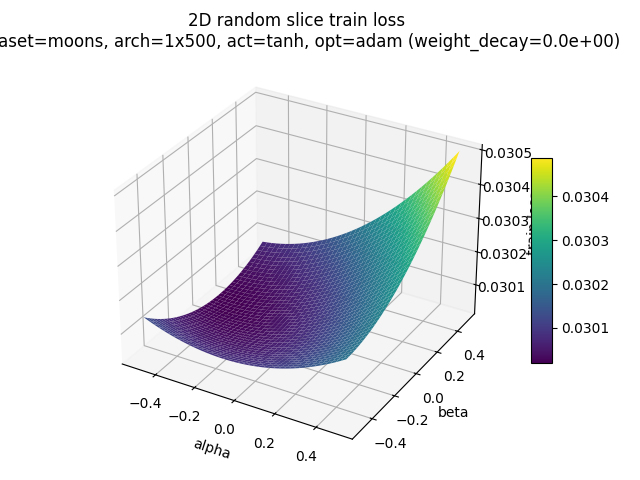 |
| moons | 1x500 | tanh | sgd | 0.0e+00, 1.0e-03 | 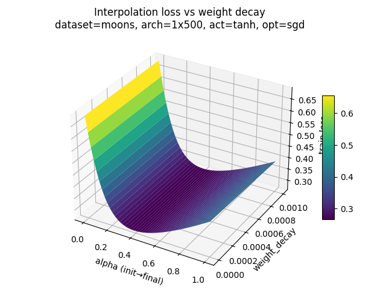 | 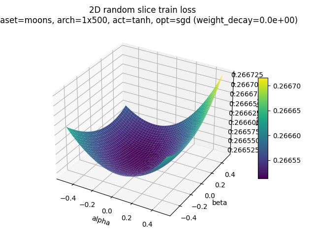 |
| moons | 1x50 | gelu | adam | 0.0e+00, 1.0e-03 |  |  |
| moons | 1x50 | gelu | sgd | 0.0e+00, 1.0e-03 | 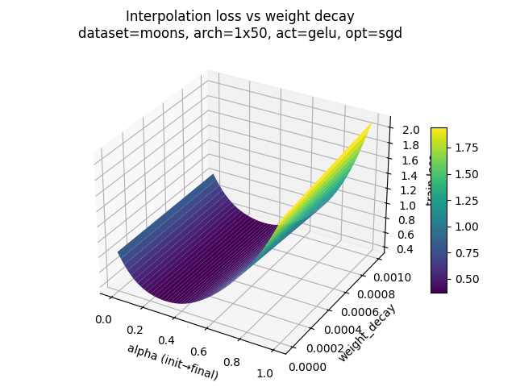 | 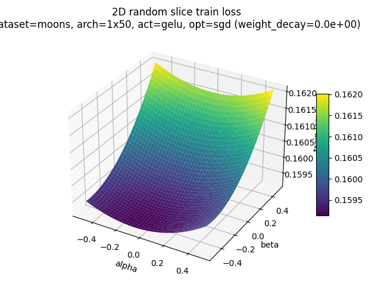 |
| moons | 1x50 | relu | adam | 0.0e+00, 1.0e-03 | 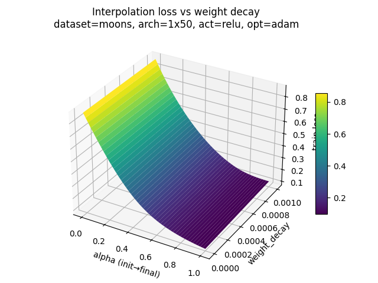 | 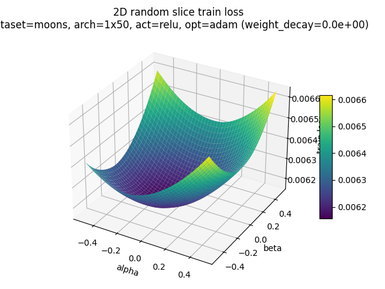 |
| moons | 1x50 | relu | sgd | 0.0e+00, 1.0e-03 | 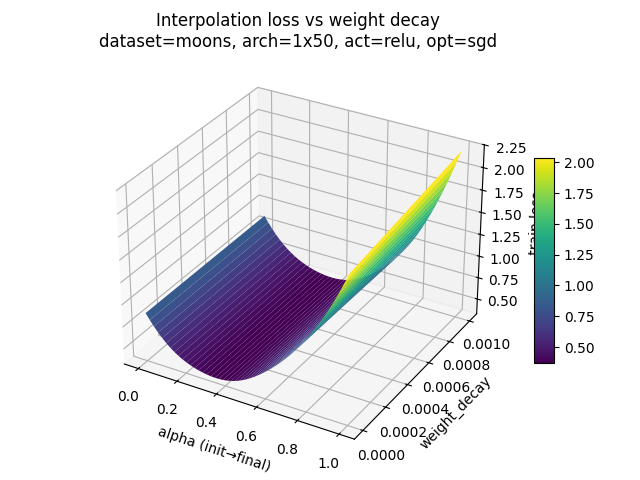 | 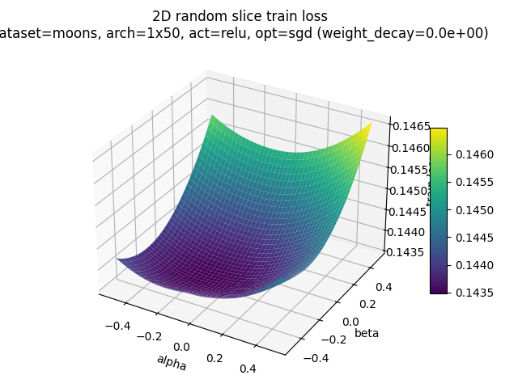 |
| moons | 1x50 | tanh | adam | 0.0e+00, 1.0e-03 |  | 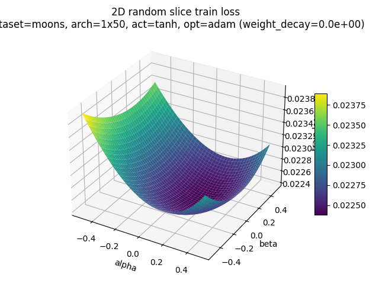 |
| moons | 1x50 | tanh | sgd | 0.0e+00, 1.0e-03 | 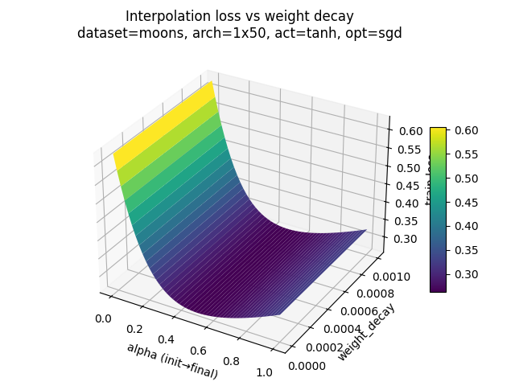 | 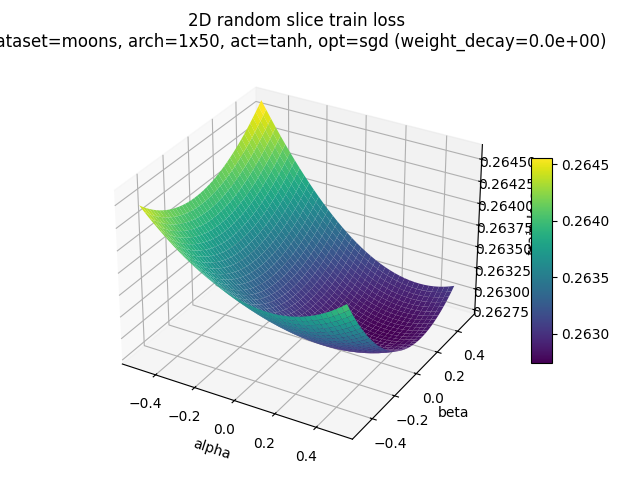 |
| moons | 2x100 | gelu | adam | 0.0e+00, 1.0e-03 | 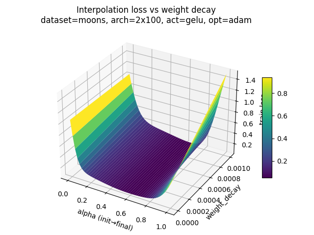 | 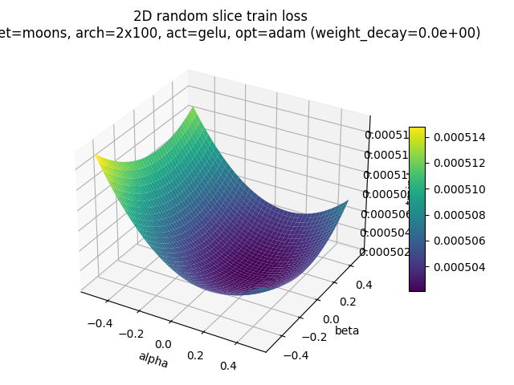 |
| moons | 2x100 | gelu | sgd | 0.0e+00, 1.0e-03 | 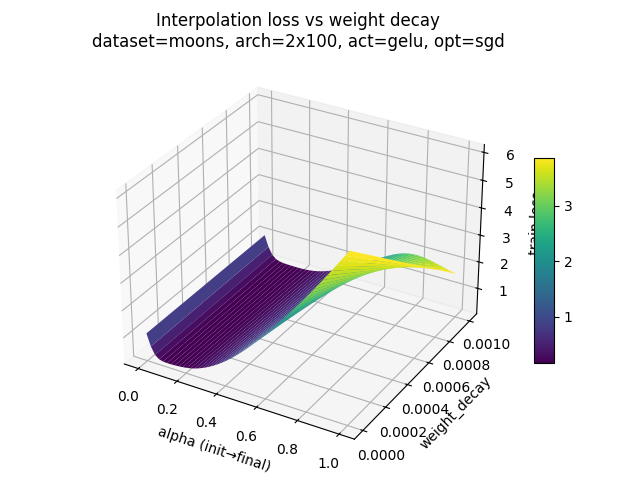 | 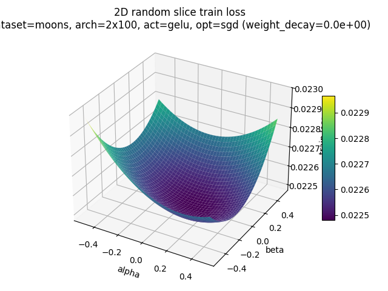 |
| moons | 2x100 | relu | adam | 0.0e+00, 1.0e-03 |  |  |
| moons | 2x100 | relu | sgd | 0.0e+00, 1.0e-03 |  |  |
| moons | 2x100 | tanh | adam | 0.0e+00, 1.0e-03 |  |  |
| moons | 2x100 | tanh | sgd | 0.0e+00, 1.0e-03 |  |  |
| moons | 4x100 | gelu | adam | 0.0e+00, 1.0e-03 |  |  |
| moons | 4x100 | gelu | sgd | 0.0e+00, 1.0e-03 |  |  |
| moons | 4x100 | relu | adam | 0.0e+00, 1.0e-03 |  |  |
| moons | 4x100 | relu | sgd | 0.0e+00, 1.0e-03 |  |  |
| moons | 4x100 | tanh | adam | 0.0e+00, 1.0e-03 |  |  |
| moons | 4x100 | tanh | sgd | 0.0e+00, 1.0e-03 |  |  |
| moons | 4x250 | gelu | adam | 0.0e+00, 1.0e-03 |  |  |
| moons | 4x250 | gelu | sgd | 0.0e+00, 1.0e-03 |  |  |
| moons | 4x250 | relu | adam | 0.0e+00, 1.0e-03 |  |  |
| moons | 4x250 | relu | sgd | 0.0e+00, 1.0e-03 |  |  |
| moons | 4x250 | tanh | adam | 0.0e+00, 1.0e-03 |  |  |
| moons | 4x250 | tanh | sgd | 0.0e+00, 1.0e-03 |  |  |

---

## References

The following external references underpin the design of our probes and interpretations:

- Goodfellow, I. et al. (2015). *Qualitatively Characterizing Neural Network Optimization Problems.* ICLR.  
  Visualizations and 1D interpolations of loss surfaces.  
  Link: http://papers.neurips.cc/paper/7875-visualizing-the-loss-landscape-of-neural-nets.pdf  
  Project page: https://www.cs.umd.edu/~tomg/projects/landscapes/

- Ghorbani, B. et al. (2019). *Investigation into Neural Net Optimization via Hessian Eigenvalue Density.* ICML.  
  Detailed empirical analysis of Hessian spectra in deep networks.  
  Link: https://proceedings.mlr.press/v97/ghorbani19b/ghorbani19b.pdf

- Yao, Z. et al. (2020). *PyHessian: Neural Networks Through the Lens of the Hessian.* IEEE Big Data.  
  Practical tools for computing Hessian spectra and trace, conceptually similar to our Hessian module.  
  Link: https://www.stat.berkeley.edu/~mmahoney/pubs/pyhessian_conf20.pdf

- Li, H. et al. (2018). *Visualizing the Loss Landscape of Neural Nets.* NeurIPS.  
  Canonical 2D projection and PCA-plane visualization of loss surfaces, which inspired our PCA-based probes.  
  Link: http://papers.neurips.cc/paper/7875-visualizing-the-loss-landscape-of-neural-nets.pdf  
  Project page: https://www.cs.umd.edu/~tomg/projects/landscapes/

- Hochreiter, S. & Schmidhuber, J. (1997). *Flat Minima.* Neural Computation.  
  Early and influential work formalizing the connection between flat minima and generalization.

- Keskar, N. et al. (2017). *On Large-Batch Training and Sharp Minima.* ICLR.  
  Shows that large-batch training can lead to sharper minima with worse generalization, motivating sharpness metrics.

- Dinh, L. et al. (2017). *Sharp Minima Can Generalize For Deep Nets.* ICML.  
  Points out that sharpness can be manipulated by reparameterization, motivating careful interpretation of sharpness metrics.

- Chaudhari, P. et al. (2017). *Entropy-SGD: Biasing Gradient Descent into Wide Valleys.* ICLR.  
  Demonstrates optimization methods explicitly biased toward wide/flat regions of the landscape.

- Foret, P. et al. (2021). *Sharpness-Aware Minimization for Efficiently Improving Generalization.* ICLR.  
  Introduces SAM, which explicitly regularizes gradients in a neighborhood of parameters to favor flat minima.  
  Link (expository): https://www.mdpi.com/2227-7390/13/8/1259

- Draxler, F. et al. (2018). *Essentially No Barriers in Neural Network Energy Landscape.* ICML.  
  Shows that independently trained solutions can often be connected via low-loss paths.  
  Link: http://proceedings.mlr.press/v80/draxler18a/draxler18a.pdf

- Garipov, T. et al. (2018). *Loss Surfaces, Mode Connectivity, and Fast Ensembling of DNNs.* NeurIPS.  
  Further develops mode connectivity ideas that motivate our linear connectivity experiments.

- Entezari, R. et al. (2021). *Role of Permutation Invariance in Linear Mode Connectivity.* ICLR.  
  Explains the importance of neuron permutation alignment for demonstrating linear connectivity.  
  Link: https://openreview.net/pdf/ab41a53471dc83982e8fe6a7f39307eb27709321.pdf

- Adilova, L. et al. (2023). *Layer-wise Linear Mode Connectivity.* ICLR.  
  Extends mode connectivity analysis at a layer-wise granularity.

- Zhou, P. et al. (2020). *Why SGD Generalizes Better Than Adam: Heavy-Tail Noise and Flat Minima.* NeurIPS.  
  Theoretically and empirically analyzes differences between SGD and Adam in terms of noise and flatness.  
  Link: https://proceedings.neurips.cc/paper/2020/file/f3f27a324736617f20abbf2ffd806f6d-Paper.pdf

- Yao, Z. et al. (2020). *Towards Theoretically Understanding Why SGD Generalizes Better than Adam.*  
  Further explores SGD vs. Adam generalization behavior.  
  Link (summary): https://liner.com/review/towards-theoretically-understanding-why-sgd-generalizes-better-than-adam-in

- Shi, S. (2025). *Sharpness Can Be Manipulated and Misleading for Generalization.* (ICLR 2026 submission).  
  Argues for caution when using sharpness as a proxy for generalization.

- Additional resources:
  - Blog post: *Visualising the Loss Landscape* (OpenDocCN translation).  
    Link: https://github.com/OpenDocCN/mlearningai-blog-zh/blob/2f42fb4cb54a07bf4dfc5bdcd93a1e1af026c26a/docs/visualising-the-loss-landscape-3a7bfa1c6fdf.md
